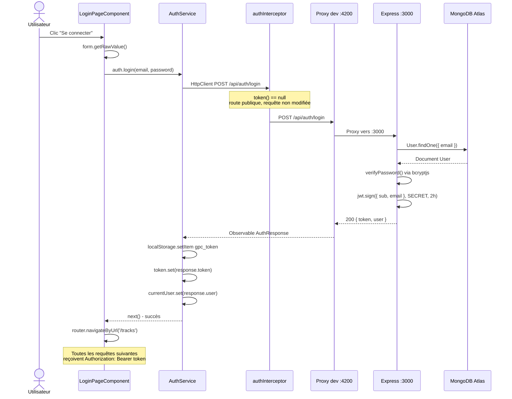

# Rapport d'usage de l'IA - TP1

Pour chaque mission, détailler et fournir des explications concernant : objectif; prompt principal; plan proposé par l'agent; vérifications réalisées par le binôme; erreurs ou propositions rejetées; fichiers effectivement modifiés; preuve de fonctionnement; ce que chaque membre sait maintenant expliquer sans l'agent.

---

## 1. Prise de connaissance du projet & Initialisation du protocole IA

**Prompt :**
> "Dans un premier temps prend connaissance de mon projet, notamment tous les fichiers .md (RAPPORT_IA_MODELE.md, SUJET_ETUDIANT_TP2.md (globalement ce que je vais devoir faire en deuxième), CONSEILS_POUR_UTIISER_ASSISTANT_AI.md, SUJET_ETUDIANT_TP3.md (globalement ce que je vais devoir faire en dernier), SUJET_ETUDIANT_TP1.md (globalement ce que je vais devoir faire en premier), frontend-starter/best-practices.md, backend/best-practices.md, API_CONTRACT.md, ATLAS_SETUP.md, frontend-starter/GEMINI.md, frontend-starter/CLAUDE.md, frontend-starter/AGENTS.md, backend/GEMINI.md, backend/CLAUDE.md, backend/AGENTS.md, README.md, RAPPORT_IA_MODELE.md) qui explique globalement le fonctionnement de l'IA dans ce projet."

### Rapport de ce que l'agent a vu et analysé
- **Structure globale des TP :**
  - **TP1 (`SUJET_ETUDIANT_TP1.md`) :** Architecture, Authentification et Profil utilisateur. Mise en place de formulaires réactifs, appels API `/api/auth/register` et `/api/auth/login`, stockage du JWT côté client, mise à jour du Signal `currentUser`, gestion du profil avec `GET` et `PUT /api/users/me`, intercepteur HTTP JWT et gestion des statuts 401.
  - **TP2 (`SUJET_ETUDIANT_TP2.md`) :** Bibliothèque de morceaux audio avec pagination côté serveur (`GET /api/tracks?page=...&limit=...`), upload multipart (avec Multer côté back) sous champs `audio` et `title` (limité à 25 Mo), lecture audio sécurisée via récupération de `Blob`, génération d'un `ObjectURL` et révocation propre à la destruction.
  - **TP3 (`SUJET_ETUDIANT_TP3.md`) :** Suppression d'une piste (`DELETE /api/tracks/:id`), suivi de la progression de l'upload via les événements HTTP Angular, et écriture d'au moins 3 tests automatisés unitaires/intégration frontend (tests sans base de données réelle).
- **Règles et bonnes pratiques de développement :**
  - **Frontend Angular 22 (`frontend-starter/best-practices.md`, `AGENTS.md`, `CLAUDE.md`, `GEMINI.md`) :** Composants standalone obligatoires (sans spécifier `standalone: true` ni `ChangeDetectionStrategy.OnPush` car ils sont activés par défaut en v22), utilisation de `inject()`, gestion réactive d'état avec les Signals, Reactive Forms, structures de contrôle natives `@if`, `@for`, `@switch`, séparation stricte composant -> service (`providedIn: 'root'`) -> `HttpClient` (jamais de `HttpClient` direct dans les composants), pas de credentials ni de secrets dans le frontend.
  - **Backend Express/Mongoose (`backend/best-practices.md`, `AGENTS.md`, `CLAUDE.md`, `GEMINI.md`) :** Utilisation de Mongoose avec schémas explicites, gestion d'erreurs asynchrones avec `async`/`await`, middlewares de validation et de sécurité, upload sécurisé avec Multer (limite 25 Mo, validation type MIME, stockage sous nom unique), logs informatifs sans données sensibles (pas de tokens, ni mots de passe, ni URI MongoDB).
- **Contrat HTTP (`API_CONTRACT.md`) :**
  - Préfixe `/api`. Routes publiques (`/health`, `/auth/register`, `/auth/login`) et routes protégées nécessitant le header `Authorization: Bearer <token>` (`/users/me`, `/tracks`, etc.). Tout changement d'API doit impérativement être consigné dans ce fichier.
- **Consignes d'utilisation de l'assistant IA (`CONSEILS_POUR_UTIISER_ASSISTANT_AI.md`) :**
  - Rôle de l'étudiant : garder la pleine maîtrise et compréhension du code, valider chaque étape, ne jamais faire de copier-coller aveugle.
  - Travail par étapes incrémentales, vérification systématique dans les DevTools (onglet Network) et via `npm run build` et tests.
  - Traçabilité des interactions avec l'IA et tenue rigoureuse du document de synthèse `RAPPORT_IA_MODELE.md`.

### Explication du premier prompt :
Il permet de donner à l'agent une vision globale du projet et de son environnement de travail. Je lui ai demandé de s'atarder dans un prermier temps tout particulièrement sur les fichiers .md pour que l'agent puisse prendre connaissance des conventions et des consignes concernant l'ia afin de les respecter. De plus il peut prendre connaissance des consignes des 3 tps afin qu'il ai une idée de l'ensemble de l'avancement du projet et qu'il n'anticipe pas des modifications qui arriveraient plus tard.

---

## 2. Analyse détaillée du Backend, Workflows, Base de Données et Sécurité

**Prompt :**
> "Maintenant que tu as une idée globale de mon projet, analyse le backend, je veux comprendre l'architecture, les workflows, les technologies et modules utilisées, comment est gérée l'authentification, comment l'upload des fichiers est gérée, comment les échanges avec la bd sont fait, génère moi des diagrammes et des schémas et mets le résultat dans backend/analyse.md. Tu ajoutera aussi dis critiques de ce code par ordre de priorité d'importance et que tu suggère des améliorations à venir. En particulier sur les aspects sécurité."

### Rapport de ce que l'agent a fait et analysé
- **Exploration et inventaire exhaustif du backend :**
  - Examen des dépendances (`package.json`) : Node.js 22 (ESM natif), Express 5.1.0, Mongoose 9.0.0, bcryptjs 3.0.2, jsonwebtoken 9.0.2, multer 2.0.2, cors 2.8.5.
  - Analyse du point d'entrée (`server.js`) : Démarrage asynchrone, validation de présence de `MONGODB_URI`, connexion MongoDB Atlas bloquante avec `mongoose.connect()`, initialisation automatique du compte `demo@example.com` si absent, gestion de l'écoute HTTP sur le port configuré.
  - Analyse de l'application et du pipeline Express (`app.js`) : Middleware de logs chronométrés, middleware CORS permissif, parseur JSON natif, middleware personnalisé `auth` (validation JWT via `jwt.verify`), configuration du stockage Multer sur disque (`diskStorage` avec UUID et extension, limite de taille 25 Mo, filtre de type MIME audio), handlers de routes pour auth, users et tracks, et gestionnaire central d'erreurs (MulterError, ValidationError, CastError).
  - Analyse des modèles Mongoose (`models/User.js` et `models/Track.js`) :
    - `User.js` : Définition du schéma avec contraintes d'unicité, setter virtuel `password`, hook `pre('validate')` pour le hachage asynchrone avec `bcryptjs` (salt 10), méthode d'instance `verifyPassword`, projection publique `toPublic()`, masquage par défaut de `passwordHash` (`select: false`).
    - `Track.js` : Référence `ownerId` vers `User`, masquage de `storedName` (`select: false`), index composite `{ ownerId: 1, createdAt: -1 }` optimisant la pagination par utilisateur, méthode `toPublic()`.
  - Examen de la suite de tests (`test/api.test.js`) : Utilisation du runner natif `node:test` pour tester `/api/health` et la conformité des schémas Mongoose sans nécessiter de connexion active à la base de données.
- **Rédaction du document d'analyse (`backend/analyse.md`) :**
  - Synthèse des technologies et justification de chaque module.
  - Schéma d'architecture globale en Mermaid (Angular <-> Express pipeline <-> Mongoose/Atlas et Filesystem).
  - Diagrammes de séquence et d'activité détaillant :
    - L'authentification (inscription `POST /api/auth/register`, connexion `POST /api/auth/login`, protection par token via le middleware `auth`).
    - L'upload audio (traitement `multipart/form-data`, vérification MIME/taille, écriture sur disque, sauvegarde MongoDB et rollback en cas d'erreur).
    - La lecture et le streaming audio (`GET /api/tracks/:id/audio` avec vérification de propriété et `res.sendFile`).
    - La suppression de piste (`DELETE /api/tracks/:id` avec nettoyage du fichier disque).
  - Diagramme Entité-Association (ERD) des collections MongoDB.
  - Revue critique hiérarchisée par niveau de risque (2 failles critiques : secret JWT par défaut et absence de rate limiting ; 3 failles élevées : CORS ouvert, filtrage MIME non vérifié par magic numbers, absence de Helmet ; points d'architecture et de maintenabilité).
  - Plan d'amélioration et recommandations concrètes de renforcement.

### Pourquoi j'ai voulu faire ça et ce que j'en ai compris
Avant de commencer le développement et apporter des modifications fonctionnelles il est important de bien comprendre le fonctionnement du backend actuellement. Cette analyse me permet donc d'avoir une idée de l'architecture pour mieux comprendre les échanges de flux de données comme la création de compte, la connexion et la gestion des fichiers audio. De plus l'explicatif des technologies utilisées me permet de mieux les comprendre. C'est le cas notament de Mongoose car je pensais initialement qu'il représentait uniquement la base de données lors des échanges de données alors qu'il s'occupe de bien plus comme par exemple l'hashage et la validation utilisateur.
Pour finir j'ai grâce à ce prompt une idée des vulnérabilités actuelles du backend d'un point de vue sécurité afin d'être en mesure de les corriger dans un avenir proche et de les expliquer.

---

## 3. Analyse détaillée du Frontend, Navigation des Données et Sécurité

**Prompt :**
> "Maintenant j'aimerais que tu fasse la même analyse que le backend mais pour le frontend en exposant les technologies utilisés, la navigation de données en la reliant avec le backend et tous les problèmes de sécurités dans l'ordre d'importance où tu proposera des améliorations. Le tout avec des schéma."

### Rapport de ce que l'agent a fait et analysé
- **Exploration approfondie du code source `frontend-starter/` :**
  - Examen des dépendances (`package.json`) : Angular 22.1.0 standalone, RxJS 7.8.0, Vitest 4.0.8, proxy de développement `proxy.conf.json`.
  - Analyse du point d'amorçage (`main.ts`) : `bootstrapApplication` avec `provideRouter(routes)` et `provideHttpClient(withInterceptors([authInterceptor]))`.
  - Cartographie des composants et de la navigation (`routes.ts`, `app/components/*`) :
    - `AppComponent` : Shell racine, barre de navigation statique (sans état réactif connecté/déconnecté).
    - `LoginPageComponent` & `RegisterPageComponent` : Formulaires réactifs (`FormGroup`), validation de base, appels d'authentification.
    - `ProfilePageComponent` : Consultation et mise à jour du profil via `AuthService`.
    - `TracksPageComponent` : Pagination serveur, upload de fichier via `FormData`, et lecture audio sécurisée via récupération de `Blob`.
  - Analyse de l'infrastructure partagée (`src/app/shared/`) :
    - `AuthService` : Gestion réactive d'état par Signals (`token`, `currentUser`) et persistance dans `localStorage`.
    - `TrackService` : Méthodes HTTP encapsulées (`list`, `upload`, `audio`).
    - `authGuard` : Garde de routage fonctionnel (`CanActivateFn`) basé sur `auth.token()`.
    - `authInterceptor` : Intercepteur HTTP fonctionnel injectant le header `Authorization: Bearer <token>`.
- **Rédaction du document d'analyse (`frontend-starter/analyse.md`) :**
  - Synthèse des technologies modernes (Angular 22 standalone, Signals, RxJS, Vitest).
  - Schéma d'architecture globale reliant les composants, les services, le stockage local, l'intercepteur, le proxy et l'API backend.
  - Diagrammes de séquence détaillés :
    - Authentification et synchronisation d'état (Formulaire -> AuthService -> API -> `localStorage` -> Signals -> Router).
    - Garde de routage et intercepteur JWT (Vérification guard -> injection Bearer token).
    - Lecture audio sécurisée en mémoire (`Blob` -> `URL.createObjectURL` -> `<audio [src]>`).
  - Revue critique de sécurité classée par sévérité (XSS sur `localStorage`, absence de capture des erreurs 401 dans l'intercepteur, fuites mémoire d'`ObjectURL` sans destruction, garde naïve, intercepteur non scopé).
  - Recommandations concrètes de renforcement (gestion 401, `DestroyRef`, validation stricte des formulaires).

### Ce que j'en ai compris, pourquoi j'ai voulu faire ça
Après avoir clarifié le backend, il est normal d'avoir la même clarté sur le frontend. Ce prompt m'a donc permis d'avoir un aperçu sur comment l'application gère les formulaires, la transition des données jusqu'au proxy et à l'API, ainsi que le fonctionnement du lecteur audio par Blob de manière plus visuel. Par ailleurs je ne comprenais pas à quoi correspondait le token JWT. Ce prompt m'a donc permis de comprendre qu'il sert de preuve d'identité émise à la connexion et que le serveur n'a pas à stocker mais uniquement à valider cette preuve et que l'intercepteur HTTP injecte le header sur chaque requête angular. De plus le fait que le serveur n'est pas à stocker cette signature ça permet, d'un point de vue sécurité, que si le payload est modifié, alors la signature ne correspond plus et le token est rejeté. 
Pour finir, des failles côté client sont aussi présentes et pourront potentiellement être corrigées par la suite.

---

## 4. Mission 0 — Cartographier l'application

**Prompt :**
> « Réalisons maintenant la mission 0 de mon TP1 dans le rapport. Retrouve et décris le composant racine, puis la configuration des routes, puis l'enregistrement de `HttpClient`, puis les modèles, services et pages, puis le mécanisme qui ajoute le JWT aux requêtes protégées et enfin créer un schéma annoté du flux lors d'un clic sur « Se connecter ». »

### Rapport de ce que l'agent a fait et analysé

#### Composant racine — `app/components/app/app.ts`
- Sélecteur HTML : `<app-root>`, c'est lui que `index.html` monte au démarrage.
- Classe vide (`export class AppComponent {}`), toute la logique est déléguée aux services.
- Importe uniquement `RouterLink` et `RouterOutlet` : il se contente d'afficher la barre de navigation et la vue de la route active via `<router-outlet>`.
- Pas d'état réactif : la barre de navigation est statique (ne change pas selon qu'on est connecté ou non).

#### Configuration des routes — `app/routes.ts`
| Route | Composant | Garde |
|---|---|---|
| `/` (vide) | → redirige vers `/tracks` | — |
| `/login` | `LoginPageComponent` | aucune |
| `/register` | `RegisterPageComponent` | aucune |
| `/profile` | `ProfilePageComponent` | `authGuard` |
| `/tracks` | `TracksPageComponent` | `authGuard` |
| `**` (tout le reste) | → redirige vers `/tracks` | — |

- Les routes `/profile` et `/tracks` sont protégées par `canActivate: [authGuard]` : si le token est absent, l'utilisateur est renvoyé vers `/login`.

#### Enregistrement de `HttpClient` — `main.ts`
```typescript
bootstrapApplication(AppComponent, {
  providers: [
    provideRouter(routes),
    provideHttpClient(withInterceptors([authInterceptor])),
  ],
});
```
- `provideHttpClient(...)` enregistre `HttpClient` pour toute l'application au niveau racine (équivalent moderne du module `HttpClientModule`).
- `withInterceptors([authInterceptor])` branche l'intercepteur JWT sur **toutes** les requêtes HTTP sortantes dès le démarrage.

#### Modèles TypeScript — `app/shared/models/`
| Fichier | Rôle |
|---|---|
| `user.model.ts` | Forme de l'objet `User` renvoyé par l'API (`id`, `name`, `email`) |
| `auth-response.model.ts` | Réponse du login/register : `{ token: string, user: User }` |
| `track.model.ts` | Forme d'une piste audio (`id`, `title`, `duration`, `createdAt`) |
| `page.model.ts` | Enveloppe de pagination : `{ data: T[], total, page, limit }` |

#### Services — `app/shared/services/`
- **`AuthService`** (`providedIn: 'root'`) :
  - Contient deux Signals : `token` (initialisé depuis `localStorage`) et `currentUser`.
  - Méthodes : `login`, `register`, `profile`, `update`, `logout`.
  - Appelle `HttpClient` directement — les composants ne touchent jamais à `HttpClient`.
- **`TrackService`** (`providedIn: 'root'`) :
  - Méthodes : `list(page, limit)`, `upload(file, title)`, `audio(id)` (réponse de type `Blob`).

#### Garde de routage — `app/shared/guards/auth.guard.ts`
```typescript
export const authGuard: CanActivateFn = () => {
  const auth = inject(AuthService);
  return auth.token() ? true : router.createUrlTree(['/login']);
};
```
- Vérifie uniquement la **présence** du token dans le Signal (pas l'expiration ni la validité cryptographique).

#### Pages (composants de page) — `app/components/`
| Composant | Responsabilité |
|---|---|
| `LoginPageComponent` | Formulaire réactif email/mot-de-passe, appel `AuthService.login()` |
| `RegisterPageComponent` | Formulaire réactif nom/email/mot-de-passe, appel `AuthService.register()` |
| `ProfilePageComponent` | Affichage + modification du nom via `AuthService.profile()` et `update()` |
| `TracksPageComponent` | Liste paginée, upload de fichier, lecture audio via `Blob` + `ObjectURL` |

#### Mécanisme JWT — `app/shared/interceptors/auth.interceptor.ts`
```typescript
export const authInterceptor: HttpInterceptorFn = (request, next) => {
  const token = inject(AuthService).token();
  return next(
    token
      ? request.clone({ setHeaders: { Authorization: `Bearer ${token}` } })
      : request,
  );
};
```
- À chaque requête HTTP, l'intercepteur lit le Signal `token` de `AuthService`.
- Si le token est présent, il **clone** la requête (immuabilité) en y ajoutant le header `Authorization: Bearer <token>`.
- Si aucun token, la requête passe telle quelle (routes publiques `/auth/login`, `/auth/register`).

---

#### Schéma annoté — Flux lors d'un clic sur « Se connecter »



### Ce que j'en ai compris
Ici, l'agent se sert des fichiers d'analyses précédemments effectuer pour fournir les livrables de la mission 0. En effet, cela permet de terminer cette phase de préparation avant le développement. On peut dès lors constater les différentes couches de l'application : le composant racine qui délègue l'affichage au routeur, le routeur, qui protège certaines routes, et l'intercepteur JWT qui branche automatiquement le token sur toutes les requêtes HTTP sans que les composants aient à s'en occuper. Le schéma de séquence permet de suivre précisément le chemin que font les données quand l'utilisateur clique sur « Se connecter » depuis le formulaire jusqu'à la réponse de MongoDB, en passant par le proxy de développement. La route /api/auth/login est publique car l'intercepteur laisse passer la requête sans token et que c'est seulement après la réponse réussie que le token est stocké dans le localStorage et dans le Signal, ce qui déclenche ainsi l'accès aux routes protégées pour toutes les requêtes suivantes. 

#### Différence entre le Signal et le localStorage
La différence entre le localStorage et le Signal est que le localStorage laisse la donnée sur le disque même si la page est fermée ou rafraîchie alors que le Signal maintient la donnée en mémoire et alèrte tous les composants en lien avec elle de son changement.
C'est pour cela qu'au démarrage de l'application AuthService initialise le Signal en lisant localStorage ce qui permet de restaurer une potentiel session existante et qu'ensuite le Signal pilote l'interface en temps réel sans que les composants aient besoin du localStorage.