# Rapport d'usage de l'IA - TP1

Pour chaque mission, détailler et fournir des explications concernant : objectif; prompt principal; plan proposé par l'agent; vérifications réalisées par le binôme; erreurs ou propositions rejetées; fichiers effectivement modifiés; preuve de fonctionnement; ce que chaque membre sait maintenant expliquer sans l'agent.

---

## 1. Prise de connaissance du projet & Initialisation du protocole IA

**Prompt :**
> "Dans un premier temps prend connaissance de mon projet, notamment tous les fichiers .md (RAPPORT_IA_MODELE.md, SUJET_ETUDIANT_TP2.md (globalement ce que je vais devoir faire en deuxième), CONSEILS_POUR_UTIISER_ASSISTANT_AI.md, SUJET_ETUDIANT_TP3.md (globalement ce que je vais devoir faire en dernier), SUJET_ETUDIANT_TP1.md (globalement ce que je vais devoir faire en premier), frontend-starter/best-practices.md, backend/best-practices.md, API_CONTRACT.md, ATLAS_SETUP.md, frontend-starter/GEMINI.md, frontend-starter/CLAUDE.md, frontend-starter/AGENTS.md, backend/GEMINI.md, backend/CLAUDE.md, backend/AGENTS.md, README.md, RAPPORT_IA_MODELE.md) qui explique globalement le fonctionnement de l'IA dans ce projet."

### Rapport de ce que l'agent a vu et analysé
- **Structure globale des TP :**
  - **TP1 (`SUJET_ETUDIANT_TP1.md`) :** Architecture, Authentification et Profil utilisateur. Mise en place de formulaires réactifs, appels API `/api/auth/register` et `/api/auth/login`, stockage du JWT côté client, mise à jour du Signal `currentUser`, gestion du profil avec `GET` et `PUT /api/users/me`, intercepteur HTTP JWT et gestion des statuts 401.
  - **TP2 (`SUJET_ETUDIANT_TP2.md`) :** Bibliothèque de morceaux audio avec pagination côté serveur (`GET /api/tracks?page=...&limit=...`), upload multipart (avec Multer côté back) sous champs `audio` et `title` (limité à 25 Mo), lecture audio sécurisée via récupération de `Blob`, génération d'un `ObjectURL` et révocation propre à la destruction.
  - **TP3 (`SUJET_ETUDIANT_TP3.md`) :** Suppression d'une piste (`DELETE /api/tracks/:id`), suivi de la progression de l'upload via les événements HTTP Angular, et écriture d'au moins 3 tests automatisés unitaires/intégration frontend (tests sans base de données réelle).
- **Règles et bonnes pratiques de développement :**
  - **Frontend Angular 22 (`frontend-starter/best-practices.md`, `AGENTS.md`, `CLAUDE.md`, `GEMINI.md`) :** Composants standalone obligatoires (sans spécifier `standalone: true` ni `ChangeDetectionStrategy.OnPush` car ils sont activés par défaut en v22), utilisation de `inject()`, gestion réactive d'état avec les Signals, Reactive Forms, structures de contrôle natives `@if`, `@for`, `@switch`, séparation stricte composant -> service (`providedIn: 'root'`) -> `HttpClient` (jamais de `HttpClient` direct dans les composants), pas de credentials ni de secrets dans le frontend.
  - **Backend Express/Mongoose (`backend/best-practices.md`, `AGENTS.md`, `CLAUDE.md`, `GEMINI.md`) :** Utilisation de Mongoose avec schémas explicites, gestion d'erreurs asynchrones avec `async`/`await`, middlewares de validation et de sécurité, upload sécurisé avec Multer (limite 25 Mo, validation type MIME, stockage sous nom unique), logs informatifs sans données sensibles (pas de tokens, ni mots de passe, ni URI MongoDB).
- **Contrat HTTP (`API_CONTRACT.md`) :**
  - Préfixe `/api`. Routes publiques (`/health`, `/auth/register`, `/auth/login`) et routes protégées nécessitant le header `Authorization: Bearer <token>` (`/users/me`, `/tracks`, etc.). Tout changement d'API doit impérativement être consigné dans ce fichier.
- **Consignes d'utilisation de l'assistant IA (`CONSEILS_POUR_UTIISER_ASSISTANT_AI.md`) :**
  - Rôle de l'étudiant : garder la pleine maîtrise et compréhension du code, valider chaque étape, ne jamais faire de copier-coller aveugle.
  - Travail par étapes incrémentales, vérification systématique dans les DevTools (onglet Network) et via `npm run build` et tests.
  - Traçabilité des interactions avec l'IA et tenue rigoureuse du document de synthèse `RAPPORT_IA_MODELE.md`.

### Explication du premier prompt :
Il permet de donner à l'agent une vision globale du projet et de son environnement de travail. Je lui ai demandé de s'atarder dans un prermier temps tout particulièrement sur les fichiers .md pour que l'agent puisse prendre connaissance des conventions et des consignes concernant l'ia afin de les respecter. Dès lors il est désormais en capacité d'expliquer dans ce rapport ce qu'il a fait pour chaque prompts. De plus il peut prendre connaissance des consignes des 3 tps afin qu'il ai une idée de l'ensemble de l'avancement du projet et qu'il n'anticipe pas des modifications qui arriveraient plus tard.

---

## 2. Analyse détaillée du Backend, Workflows, Base de Données et Sécurité

**Prompt :**
> "Maintenant que tu as une idée globale de mon projet, analyse le backend, je veux comprendre l'architecture, les workflows, les technologies et modules utilisées, comment est gérée l'authentification, comment l'upload des fichiers est gérée, comment les échanges avec la bd sont fait, génère moi des diagrammes et des schémas et mets le résultat dans backend/analyse.md. Tu ajoutera aussi dis critiques de ce code par ordre de priorité d'importance et que tu suggère des améliorations à venir. En particulier sur les aspects sécurité."

### Rapport de ce que l'agent a fait et analysé
- **Exploration et inventaire exhaustif du backend :**
  - Examen des dépendances (`package.json`) : Node.js 22 (ESM natif), Express 5.1.0, Mongoose 9.0.0, bcryptjs 3.0.2, jsonwebtoken 9.0.2, multer 2.0.2, cors 2.8.5.
  - Analyse du point d'entrée (`server.js`) : Démarrage asynchrone, validation de présence de `MONGODB_URI`, connexion MongoDB Atlas bloquante avec `mongoose.connect()`, initialisation automatique du compte `demo@example.com` si absent, gestion de l'écoute HTTP sur le port configuré.
  - Analyse de l'application et du pipeline Express (`app.js`) : Middleware de logs chronométrés, middleware CORS permissif, parseur JSON natif, middleware personnalisé `auth` (validation JWT via `jwt.verify`), configuration du stockage Multer sur disque (`diskStorage` avec UUID et extension, limite de taille 25 Mo, filtre de type MIME audio), handlers de routes pour auth, users et tracks, et gestionnaire central d'erreurs (MulterError, ValidationError, CastError).
  - Analyse des modèles Mongoose (`models/User.js` et `models/Track.js`) :
    - `User.js` : Définition du schéma avec contraintes d'unicité, setter virtuel `password`, hook `pre('validate')` pour le hachage asynchrone avec `bcryptjs` (salt 10), méthode d'instance `verifyPassword`, projection publique `toPublic()`, masquage par défaut de `passwordHash` (`select: false`).
    - `Track.js` : Référence `ownerId` vers `User`, masquage de `storedName` (`select: false`), index composite `{ ownerId: 1, createdAt: -1 }` optimisant la pagination par utilisateur, méthode `toPublic()`.
  - Examen de la suite de tests (`test/api.test.js`) : Utilisation du runner natif `node:test` pour tester `/api/health` et la conformité des schémas Mongoose sans nécessiter de connexion active à la base de données.
- **Rédaction du document d'analyse (`backend/analyse.md`) :**
  - Synthèse des technologies et justification de chaque module.
  - Schéma d'architecture globale en Mermaid (Angular <-> Express pipeline <-> Mongoose/Atlas et Filesystem).
  - Diagrammes de séquence et d'activité détaillant :
    - L'authentification (inscription `POST /api/auth/register`, connexion `POST /api/auth/login`, protection par token via le middleware `auth`).
    - L'upload audio (traitement `multipart/form-data`, vérification MIME/taille, écriture sur disque, sauvegarde MongoDB et rollback en cas d'erreur).
    - La lecture et le streaming audio (`GET /api/tracks/:id/audio` avec vérification de propriété et `res.sendFile`).
    - La suppression de piste (`DELETE /api/tracks/:id` avec nettoyage du fichier disque).
  - Diagramme Entité-Association (ERD) des collections MongoDB.
  - Revue critique hiérarchisée par niveau de risque (2 failles critiques : secret JWT par défaut et absence de rate limiting ; 3 failles élevées : CORS ouvert, filtrage MIME non vérifié par magic numbers, absence de Helmet ; points d'architecture et de maintenabilité).
  - Plan d'amélioration et recommandations concrètes de renforcement.

### Pourquoi j'ai voulu faire ça et ce que j'en ai compris
Avant de commencer le développement et apporter des modifications fonctionnelles il est important de bien comprendre le fonctionnement du backend actuellement. Cette analyse me permet donc d'avoir une idée de l'architecture pour mieux comprendre les échanges de flux de données comme la création de compte, la connexion et la gestion des fichiers audio. De plus l'explicatif des technologies utilisées me permet de mieux les comprendre. C'est le cas notament de Mongoose car je pensais initialement qu'il représentait uniquement la base de données lors des échanges de données alors qu'il s'occupe de bien plus comme par exemple l'hashage et la validation utilisateur.
Pour finir j'ai grâce à ce prompt une idée des vulnérabilités actuelles du backend d'un point de vue sécurité afin d'être en mesure de les corriger dans un avenir proche et de les expliquer.

---

## 3. Analyse détaillée du Frontend, Navigation des Données et Sécurité

**Prompt :**
> "Maintenant j'aimerais que tu fasse la même analyse que le backend mais pour le frontend en exposant les technologies utilisés, la navigation de données en la reliant avec le backend et tous les problèmes de sécurités dans l'ordre d'importance où tu proposera des améliorations. Le tout avec des schéma."

### Rapport de ce que l'agent a fait et analysé
- **Exploration approfondie du code source `frontend-starter/` :**
  - Examen des dépendances (`package.json`) : Angular 22.1.0 standalone, RxJS 7.8.0, Vitest 4.0.8, proxy de développement `proxy.conf.json`.
  - Analyse du point d'amorçage (`main.ts`) : `bootstrapApplication` avec `provideRouter(routes)` et `provideHttpClient(withInterceptors([authInterceptor]))`.
  - Cartographie des composants et de la navigation (`routes.ts`, `app/components/*`) :
    - `AppComponent` : Shell racine, barre de navigation statique (sans état réactif connecté/déconnecté).
    - `LoginPageComponent` & `RegisterPageComponent` : Formulaires réactifs (`FormGroup`), validation de base, appels d'authentification.
    - `ProfilePageComponent` : Consultation et mise à jour du profil via `AuthService`.
    - `TracksPageComponent` : Pagination serveur, upload de fichier via `FormData`, et lecture audio sécurisée via récupération de `Blob`.
  - Analyse de l'infrastructure partagée (`src/app/shared/`) :
    - `AuthService` : Gestion réactive d'état par Signals (`token`, `currentUser`) et persistance dans `localStorage`.
    - `TrackService` : Méthodes HTTP encapsulées (`list`, `upload`, `audio`).
    - `authGuard` : Garde de routage fonctionnel (`CanActivateFn`) basé sur `auth.token()`.
    - `authInterceptor` : Intercepteur HTTP fonctionnel injectant le header `Authorization: Bearer <token>`.
- **Rédaction du document d'analyse (`frontend-starter/analyse.md`) :**
  - Synthèse des technologies modernes (Angular 22 standalone, Signals, RxJS, Vitest).
  - Schéma d'architecture globale reliant les composants, les services, le stockage local, l'intercepteur, le proxy et l'API backend.
  - Diagrammes de séquence détaillés :
    - Authentification et synchronisation d'état (Formulaire -> AuthService -> API -> `localStorage` -> Signals -> Router).
    - Garde de routage et intercepteur JWT (Vérification guard -> injection Bearer token).
    - Lecture audio sécurisée en mémoire (`Blob` -> `URL.createObjectURL` -> `<audio [src]>`).
  - Revue critique de sécurité classée par sévérité (XSS sur `localStorage`, absence de capture des erreurs 401 dans l'intercepteur, fuites mémoire d'`ObjectURL` sans destruction, garde naïve, intercepteur non scopé).
  - Recommandations concrètes de renforcement (gestion 401, `DestroyRef`, validation stricte des formulaires).

### Ce que j'en ai compris, pourquoi j'ai voulu faire ça
Après avoir clarifié le backend, il est normal d'avoir la même clarté sur le frontend. Ce prompt m'a donc permis d'avoir un aperçu sur comment l'application gère les formulaires, la transition des données jusqu'au proxy et à l'API, ainsi que le fonctionnement du lecteur audio par Blob de manière plus visuel. Par ailleurs je ne comprenais pas à quoi correspondait le token JWT. Ce prompt m'a donc permis de comprendre qu'il sert de preuve d'identité émise à la connexion et que le serveur n'a pas à stocker mais uniquement à valider cette preuve et que l'intercepteur HTTP injecte le header sur chaque requête angular. De plus le fait que le serveur n'est pas à stocker cette signature ça permet, d'un point de vue sécurité, que si le payload est modifié, alors la signature ne correspond plus et le token est rejeté. 
Pour finir, des failles côté client sont aussi présentes et pourront potentiellement être corrigées par la suite.

---

## 4. Mission 0 : Cartographier l'application

**Prompt :**
> « Réalisons maintenant la mission 0 de mon TP1 dans le rapport. Retrouve et décris le composant racine, puis la configuration des routes, puis l'enregistrement de `HttpClient`, puis les modèles, services et pages, puis le mécanisme qui ajoute le JWT aux requêtes protégées et enfin créer un schéma annoté du flux lors d'un clic sur « Se connecter ». »

### Rapport de ce que l'agent a fait et analysé

#### Composant racine : `app/components/app/app.ts`
- Sélecteur HTML : `<app-root>`, c'est lui que `index.html` monte au démarrage.
- Classe vide (`export class AppComponent {}`), toute la logique est déléguée aux services.
- Importe uniquement `RouterLink` et `RouterOutlet` : il se contente d'afficher la barre de navigation et la vue de la route active via `<router-outlet>`.
- Pas d'état réactif : la barre de navigation est statique (ne change pas selon qu'on est connecté ou non).

#### Configuration des routes : `app/routes.ts`
| Route | Composant | Garde |
|---|---|---|
| `/` (vide) | → redirige vers `/tracks` | : |
| `/login` | `LoginPageComponent` | aucune |
| `/register` | `RegisterPageComponent` | aucune |
| `/profile` | `ProfilePageComponent` | `authGuard` |
| `/tracks` | `TracksPageComponent` | `authGuard` |
| `**` (tout le reste) | → redirige vers `/tracks` | : |

- Les routes `/profile` et `/tracks` sont protégées par `canActivate: [authGuard]` : si le token est absent, l'utilisateur est renvoyé vers `/login`.

#### Enregistrement de `HttpClient` : `main.ts`
```typescript
bootstrapApplication(AppComponent, {
  providers: [
    provideRouter(routes),
    provideHttpClient(withInterceptors([authInterceptor])),
  ],
});
```
- `provideHttpClient(...)` enregistre `HttpClient` pour toute l'application au niveau racine (équivalent moderne du module `HttpClientModule`).
- `withInterceptors([authInterceptor])` branche l'intercepteur JWT sur **toutes** les requêtes HTTP sortantes dès le démarrage.

#### Modèles TypeScript : `app/shared/models/`
| Fichier | Rôle |
|---|---|
| `user.model.ts` | Forme de l'objet `User` renvoyé par l'API (`id`, `name`, `email`) |
| `auth-response.model.ts` | Réponse du login/register : `{ token: string, user: User }` |
| `track.model.ts` | Forme d'une piste audio (`id`, `title`, `duration`, `createdAt`) |
| `page.model.ts` | Enveloppe de pagination : `{ data: T[], total, page, limit }` |

#### Services : `app/shared/services/`
- **`AuthService`** (`providedIn: 'root'`) :
  - Contient deux Signals : `token` (initialisé depuis `localStorage`) et `currentUser`.
  - Méthodes : `login`, `register`, `profile`, `update`, `logout`.
  - Appelle `HttpClient` directement : les composants ne touchent jamais à `HttpClient`.
- **`TrackService`** (`providedIn: 'root'`) :
  - Méthodes : `list(page, limit)`, `upload(file, title)`, `audio(id)` (réponse de type `Blob`).

#### Garde de routage : `app/shared/guards/auth.guard.ts`
```typescript
export const authGuard: CanActivateFn = () => {
  const auth = inject(AuthService);
  return auth.token() ? true : router.createUrlTree(['/login']);
};
```
- Vérifie uniquement la **présence** du token dans le Signal (pas l'expiration ni la validité cryptographique).

#### Pages (composants de page) : `app/components/`
| Composant | Responsabilité |
|---|---|
| `LoginPageComponent` | Formulaire réactif email/mot-de-passe, appel `AuthService.login()` |
| `RegisterPageComponent` | Formulaire réactif nom/email/mot-de-passe, appel `AuthService.register()` |
| `ProfilePageComponent` | Affichage + modification du nom via `AuthService.profile()` et `update()` |
| `TracksPageComponent` | Liste paginée, upload de fichier, lecture audio via `Blob` + `ObjectURL` |

#### Mécanisme JWT : `app/shared/interceptors/auth.interceptor.ts`
```typescript
export const authInterceptor: HttpInterceptorFn = (request, next) => {
  const token = inject(AuthService).token();
  return next(
    token
      ? request.clone({ setHeaders: { Authorization: `Bearer ${token}` } })
      : request,
  );
};
```
- À chaque requête HTTP, l'intercepteur lit le Signal `token` de `AuthService`.
- Si le token est présent, il **clone** la requête (immuabilité) en y ajoutant le header `Authorization: Bearer <token>`.
- Si aucun token, la requête passe telle quelle (routes publiques `/auth/login`, `/auth/register`).

---

#### Schéma annoté : Flux lors d'un clic sur « Se connecter »

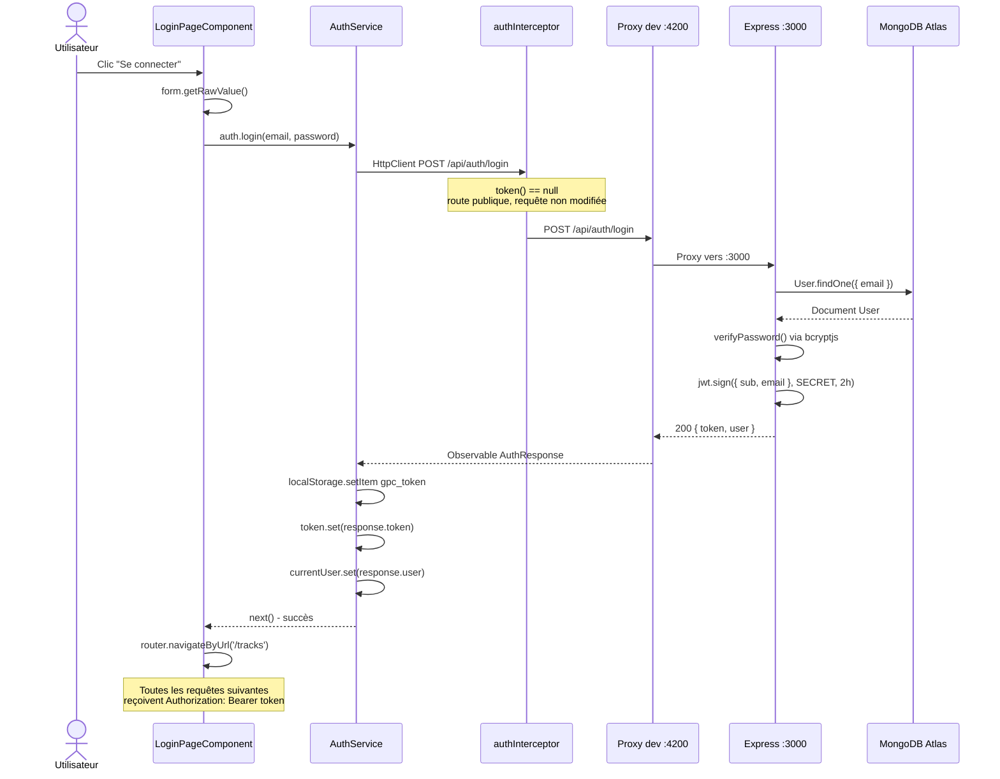

### Ce que j'en ai compris
Ici, l'agent se sert des fichiers d'analyses précédemments effectuer pour fournir les livrables de la mission 0. En effet, cela permet de terminer cette phase de préparation avant le développement. On peut dès lors constater les différentes couches de l'application : le composant racine qui délègue l'affichage au routeur, le routeur, qui protège certaines routes, et l'intercepteur JWT qui branche automatiquement le token sur toutes les requêtes HTTP sans que les composants aient à s'en occuper. Le schéma de séquence permet de suivre précisément le chemin que font les données quand l'utilisateur clique sur « Se connecter » depuis le formulaire jusqu'à la réponse de MongoDB, en passant par le proxy de développement. La route /api/auth/login est publique car l'intercepteur laisse passer la requête sans token et que c'est seulement après la réponse réussie que le token est stocké dans le localStorage et dans le Signal, ce qui déclenche ainsi l'accès aux routes protégées pour toutes les requêtes suivantes. 

#### Différence entre le Signal et le localStorage
La différence entre le localStorage et le Signal est que le localStorage laisse la donnée sur le disque même si la page est fermée ou rafraîchie alors que le Signal maintient la donnée en mémoire et alèrte tous les composants en lien avec elle de son changement.
C'est pour cela qu'au démarrage de l'application AuthService initialise le Signal en lisant localStorage ce qui permet de restaurer une potentiel session existante et qu'ensuite le Signal pilote l'interface en temps réel sans que les composants aient besoin du localStorage.

---

## 5. Mission 1 : Compléter la partie utilisateur du frontend

**Prompt :**
> « Maintenant j'aimerais réaliser la mission 1 : Compléter ou réécrire la partie utilisateur du frontend : formulaires réactifs pour l'inscription et la connexion ; validations et messages d'erreur compréhensibles ; appels de /api/auth/register et /api/auth/login ; sauvegarde du JWT côté navigateur, sans jamais l'afficher dans les logs ; mise à jour du Signal currentUser ; redirection après une connexion ou une inscription réussie ; bouton de déconnexion avec nettoyage de l'état local ; chargement de /api/users/me lorsque le profil est demandé ; modification du nom avec PUT /api/users/me ; gestion d'un 401, avec retour vers /login si le token est invalide ou expiré. »
### Rapport de ce que l'agent a fait et analysé

#### 1. `auth.interceptor.ts` : Ajout de la gestion du 401
**Problème :** L'intercepteur original ne faisait qu'ajouter le token. Si le serveur répondait `401 Unauthorized` (token expiré ou invalide), rien ne se passait côté client.

**Ce qui a été ajouté :**
- Import de `catchError` et `throwError` de RxJS.
- Import de `Router`.
- Pipeline `.pipe(catchError(...))` sur la réponse HTTP : si le statut est `401`, `auth.logout()` est appelé (nettoyage `localStorage` + remise à zéro des Signals) puis `router.navigateByUrl('/login')` redirige l'utilisateur.
- La requête rejetée est relancée via `throwError(() => error)` pour que les composants puissent aussi catcher l'erreur si nécessaire.

```typescript
return next(req).pipe(
  catchError((error: { status?: number }) => {
    if (error.status === 401) {
      auth.logout();
      void router.navigateByUrl('/login');
    }
    return throwError(() => error);
  }),
);
```

---

#### 2. `login-page.ts` + `login-page.html` : Connexion renforcée

**Modifications du composant :**
- Suppression des valeurs par défaut `demo@example.com` / `Demo1234!` (faille de sécurité : des credentials ne doivent pas être codés en dur dans le source).
- Ajout du validateur `Validators.minLength(8)` sur le mot de passe.
- Ajout du Signal `loading` : mis à `true` au début de la requête, `false` à la fin (succès ou erreur), pour désactiver le bouton et prévenir le double-envoi.
- Suppression du `console.debug` qui affichait le résultat de connexion (le token ne doit jamais apparaître dans les logs).
- Ajout d'un `if (this.form.invalid) return;` de garde en début de `submit()`.

**Modifications du template :**
- Messages d'erreur par champ (apparus uniquement après que le champ a été touché) :
  - Email : « L'adresse email est requise » / « Veuillez entrer une adresse email valide ».
  - Mot de passe : « Le mot de passe est requis » / « Le mot de passe doit contenir au moins 8 caractères ».
- Bouton `[disabled]="form.invalid || loading()"` : désactivé si le formulaire est invalide OU si une requête est en cours.
- Texte du bouton dynamique : « Se connecter » → « Connexion… » pendant le chargement.
- Attributs `autocomplete` sur les inputs (bonne pratique UX).

---

#### 3. `register-page.ts` + `register-page.html` : Inscription renforcée

**Modifications du composant :**
- Ajout de `Validators.minLength(2)` sur le champ `name`.
- Ajout de `Validators.minLength(8)` sur le champ `password`.
- Ajout du Signal `loading`.
- Redirection vers `/tracks` (au lieu de `/profile`) après inscription réussie, cohérent avec le comportement de la connexion.
- Suppression des `console.debug` / `console.error` remplacés par le Signal `error`.

**Modifications du template :**
- Messages d'erreur par champ sur les trois champs (nom, email, mot de passe).
- Bouton désactivé si formulaire invalide ou chargement en cours.
- Texte du bouton dynamique : « Créer mon compte » → « Inscription… ».

---

#### 4. `profile-page.ts` + `profile-page.html` : Profil automatique et feedback utilisateur

**Modifications du composant :**
- Implémentation de `OnInit` : le profil est désormais chargé automatiquement à l'ouverture de la page (`ngOnInit` → `auth.profile().subscribe(...)`) sans que l'utilisateur ait à cliquer sur « Charger mon profil ».
- Ajout du Signal `saved` : passe à `true` après un enregistrement réussi pour afficher un message de confirmation.
- Ajout du Signal `error` : affiche le message d'erreur renvoyé par l'API (ou un message générique) en cas d'échec.
- Ajout du Signal `loading` : désactive le bouton pendant la requête `PUT`.
- Suppression de tous les `console.debug` et `console.error` : l'état est géré par les Signals visibles dans l'UI.
- Ajout de `Validators.minLength(2)` sur le champ nom.

**Modifications du template :**
- Suppression du bouton manuel « Charger mon profil ».
- Affichage d'un état de chargement (« Chargement du profil… ») tant que `currentUser` est `null`.
- Message de succès (« Nom mis à jour avec succès ✓ ») via `@if (saved())`.
- Message d'erreur via `@if (error())`.
- Validation par champ sur le nom.
- Bouton désactivé si formulaire invalide ou loading.

---

#### 5. `app.ts` + `app.html` : Navigation réactive et déconnexion

**Modifications du composant :**
- Injection de `AuthService` (exposé en `readonly auth` pour être lisible dans le template).
- Injection de `Router`.
- Ajout de la méthode `logout()` : appelle `auth.logout()` (nettoie `localStorage` et remet les Signals à `null`) puis redirige vers `/login`.

**Modifications du template :**
- La barre de navigation est maintenant **réactive au Signal `auth.token()`** :
  - Si connecté (`auth.token()` est non nul) : affiche « Backing tracks », « Profil » et un bouton « Déconnexion ».
  - Si non connecté : affiche uniquement « Connexion » et « Créer un compte ».
- Le bouton Déconnexion déclenche `logout()` sur le composant racine.

```html
@if (auth.token()) {
  <a routerLink="/tracks">Backing tracks</a>
  <a routerLink="/profile">Profil</a>
  <button type="button" (click)="logout()">Déconnexion</button>
} @else {
  <a routerLink="/login">Connexion</a>
  <a routerLink="/register">Créer un compte</a>
}
```

---

#### Vérification : build Angular
```
✅ ng build → 0 erreur, 0 warning : bundle : 297 kB (main.js)
```

### Ce que j'en ai compris, pourquoi j'ai voulu faire ça
Il s'agît de la première phase de développement du TP1. Il faut donc compléter le starter pour avoir une connexion, inscription et déconnexion fonctionnelles avec des retours visuels clairs. J'ai compris qu'il était important de séparer les responsabilités : les composants ne touchent jamais HttpClient directement car ils délèguent tout à AuthService. Les Signals permettent à l'interface de se mettre à jour automatiquement dès que l'état change (cela peut être dû à une connexion, déconnexion ou une modification du nom de l'utilisateur) sans qu'il soit nécessaire de recharger la page. La gestion du 401 dans l'intercepteur permet de déconnecter l'utilisateur "proprement" si un token a expiré.

### Modèle d'IA que j'utilise
Le modèle d'IA que j'utilisais était initialement Gemini Code Assist (gratuit pendant un an pour les étudiants). Sauf que l'extension VSCode est obsolète car google a migré ses services dans Antigravity j'ai donc était contraint de changer d'extensions et passer sur Antigravity. Or toutes les tokens de la semaine ont été utilisés à la fin de la mission 0 du TP1 ce qui signifie que j'ai dû mettre à niveau l'abonnement pour passer au forfait Google AI Pro pour 5€49/mois afin d'avoir plus de tokens par semaine. Pour observer combien il m'en reste, je dois aller dans les paramètres de l'extension puis dans le sous menu models où je peux observer combien il me reste de tokens pour chaque IA (exemple dans la photo ci-dessous).
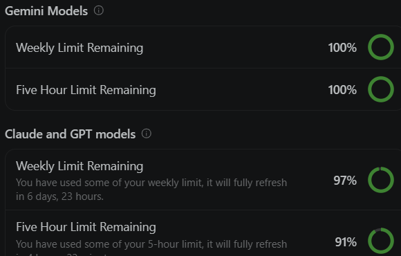
Les conseils pour l'utilisation de l'IA me viennent de l'IA elle-même ou de mon père qui, pour son travail, utilise Copilot dans VSCode.

### Résumé des routes backend

| Méthode | Route | Accès | Usage |
|---|---|---|---|
| `POST` | `/api/auth/register` | Public | Créer un nouveau compte utilisateur |
| `POST` | `/api/auth/login` | Public | Se connecter et recevoir un JWT |
| `GET` | `/api/users/me` | Protégé (JWT) | Charger le profil de l'utilisateur connecté |
| `PUT` | `/api/users/me` | Protégé (JWT) | Modifier le nom de l'utilisateur connecté |
| `GET` | `/api/tracks` | Protégé (JWT) | Lister les pistes audio avec pagination |
| `POST` | `/api/tracks` | Protégé (JWT) | Uploader une nouvelle piste audio |
| `GET` | `/api/tracks/:id/audio` | Protégé (JWT) | Récupérer le fichier audio d'une piste |

### Tests de connexion

#### Apparition d'une requête de connexion réussie
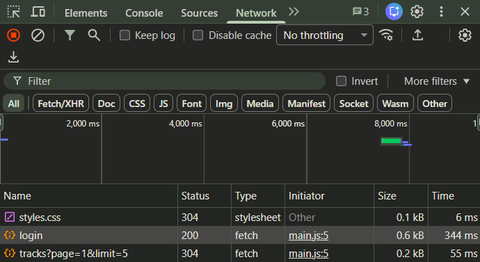

Header
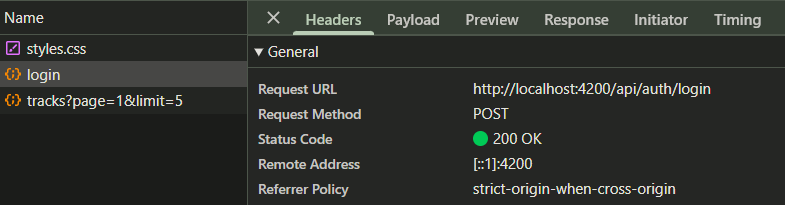

Payload (Problème de sécurité car le mot de passe est affiché en clair pouvant être accessible par un renifleur)
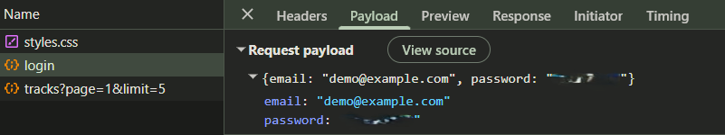

#### Apparition d'une requête de connexion échouée
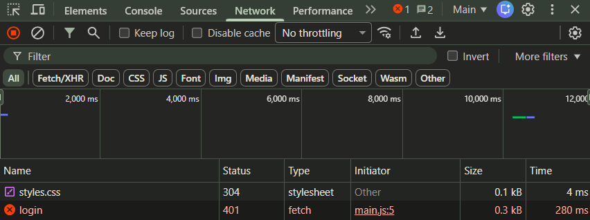

Header (erreur 401 bien renvoyé)
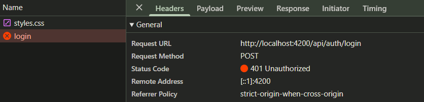

Payload (Problème de sécurité avec mot de passe toujours en clair)
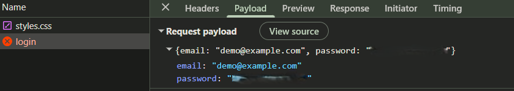

#### Modification de /api/users/me (changement de nom)
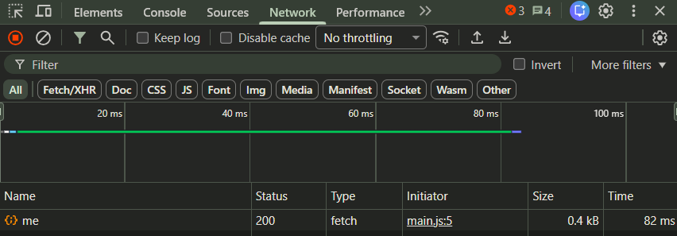

Header
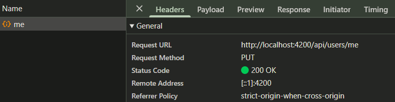

Payload
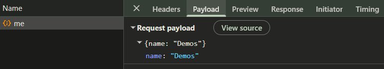

# Rapport d'usage de l'IA - TP2

## 1. Mission 2 : Bibliothèque paginée côté serveur

**Prompt :**
> « Passons maintenant au TP2. Reprends connaissance en détails de SUJET_ETUDIANT_TP2.md et implémente ou vérifie TrackService.list(page, limit) (sans modifier le backend qui fournit déjà GET /api/tracks?page=1&limit=5) afin qu'il transmette réellement page et limit. Le flux attendu est composant bibliothèque → TrackService → HttpClient → GET /api/tracks?page=...&limit=... Affiche les résultats avec @for, l’état vide avec @empty et le chargement avec @if. Ajouter les boutons « Précédent » et « Suivant », désactivés aux bornes. Après chaque changement de page, effectuer une nouvelle requête HTTP. Il est interdit de récupérer toutes les pistes puis de les découper localement dans Angular. »

### Rapport de ce que l'agent a fait et analysé

#### 1. Vérification du service `TrackService` (`shared/services/track.service.ts`)
- Inspection de la méthode `list(page = 1, limit = 5)` :
  ```typescript
  list(page = 1, limit = 5) {
    return this.http.get<Page<Track>>('/api/tracks', {
      params: { page, limit },
    });
  }
  ```
- Constat : `TrackService` utilise bien l'objet `params: { page, limit }` d'Angular `HttpClient`. Lors de la requête HTTP, `HttpClient` sérialise ces paramètres en query string d'URL : `/api/tracks?page=...&limit=...`.
- Le backend (`backend/src/app.js`) lit ces paramètres avec `req.query.page` et `req.query.limit`, puis effectue une pagination MongoDB native avec `skip((page - 1) * limit)` et `limit(limit)`.

#### 2. Mise à jour de `TracksPageComponent` (`components/tracks-page/tracks-page.ts`)
- Définition et gestion complète des Signals réactifs requis :
  - `tracks = signal<Track[]>([])` : liste des pistes de la page actuelle.
  - `page = signal(1)` : numéro de la page courante (démarre à 1).
  - `pages = signal(1)` : total de pages retourné par l'API (`response.pages`).
  - `loading = signal(false)` : indicateur de chargement réseau.
  - `error = signal('')` : gestion des messages d'erreur HTTP.
- Méthode `load()` :
  - Déclenchée au montage (`constructor`) et à chaque changement de page.
  - Appelle `this.service.list(this.page(), 5)` pour récupérer uniquement les 5 pistes de la page demandée.
  - Met à jour `tracks`, `pages`, et bascule `loading` à `true` puis `false`.
- Méthode `go(newPage: number)` :
  - Vérifie les bornes (`if (page < 1 || page > this.pages() || page === this.page()) return;`).
  - Met à jour le signal `page` puis invoque immédiatement `this.load()`, générant un nouvel appel HTTP serveur (aucune découpe locale).

#### 3. Mise à jour du template (`components/tracks-page/tracks-page.html`)
- Utilisation des nouvelles structures de contrôle Angular :
  - `@if (loading())` : affichage du message « Chargement… ».
  - `@for (track of tracks(); track track.id)` : rendu dynamique des cartes de morceaux.
  - `@empty` : affichage de « Aucune piste. » si la liste reçue est vide (hors chargement).
  - `@if (error())` : restitution des erreurs d'API éventuelles.
- Contrôles de pagination :
  - Bouton **« Précédent »** : désactivé si `page() <= 1 || loading()`.
  - Indicateur textuel : `Page {{ page() }} / {{ pages() }}`.
  - Bouton **« Suivant »** : désactivé si `page() >= pages() || loading()`.

#### 4. Vérification et validation du build
- Exécution de `npm run build` côté frontend :
  - Compilation réussie (`0 erreur`, `0 warning`, bundle `297.54 kB`).

### Ce que j'en ai compris, pourquoi j'ai voulu faire ça
Dans cette mission, il faut s'assurer que la pagination s'effectue intégralement côté serveur et non côté client. C'est pour ça que j'ai reprécisé une partie des consignes dans le prompt. En effet si l'application chargeait l'intégralité des pistes en mémoire pour les paginer dans le navigateur, cela poserait un problème de performance car le système pourrait considérablement ralentir pour un grand nombre de données en mémoire. 
Alors que grâce au flux Composant → TrackService.list(page, limit) → HttpClient → API Express (skip/limit) → MongoDB, le client ne reçoit et ne stocke que les 5 éléments requis pour la page active. Enfin l'utilisation des Signals permettent de synchroniser l'état des boutons Précédent et Suivant ainsi que l'affichage des morceaux de manière réactive à chaque nouvelle action.

### Captures network de l'upload d'un son invalide
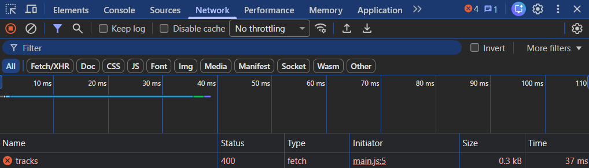
#### Header (renvoie l'erreur 400 comme prévu)
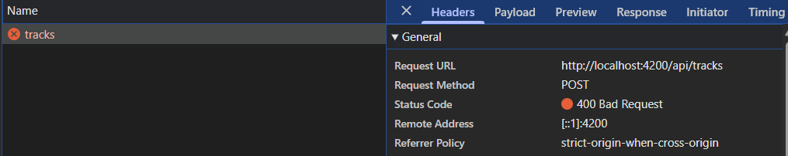 
#### Payload (erreur car le format du fichier est .zip)
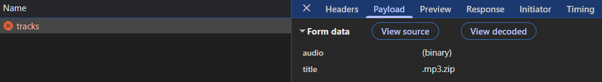

### Captures network de l'upload d'un son puis de la pagination et enfin de la lecture d'un son
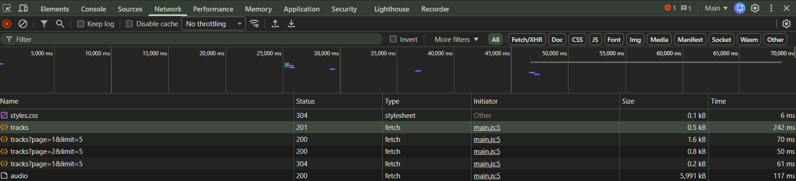

#### Upload
##### Header
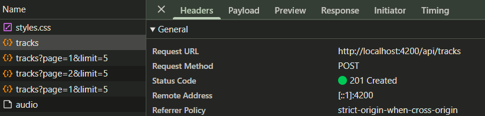
##### Payload (titre donnée à la musique visible)
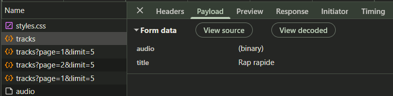

#### Retour en page une
##### Header
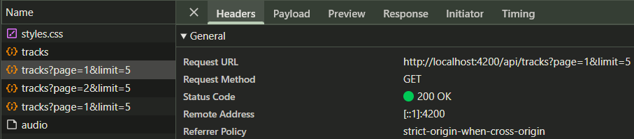
##### Payload (Numéro de page et limite à la page visible)
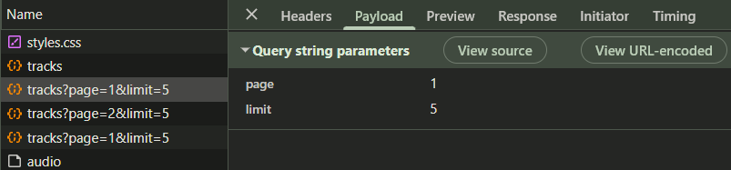

On voit bien ici que l'utilisateur à uploadé une musique puis s'est rendu en page une, puis en page deux, puis de nouveau en page une et qu'il a terminé par lire une musique

#### Lecture musique (Pas de Payload ici car il n'y a pas de requête envoyée)
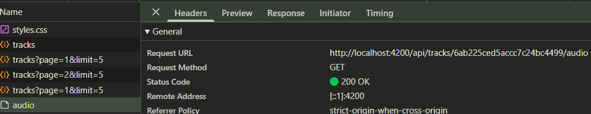
Lecture possible grâce à blob
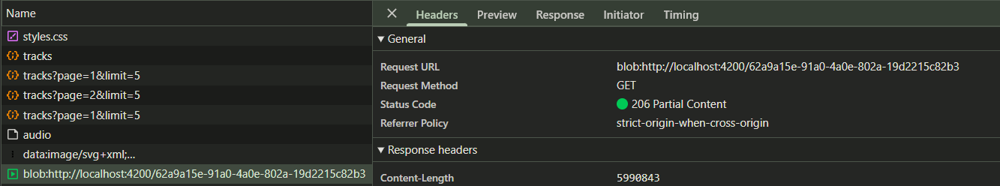

### Le choix de Blob

Blob est un objet JavaScript représentant des données brutes sous forme binaire. Dans notre architecture Blob est utile d'un point de vu sécurité car il s'assure de la protection de la ressource par JWT par le biais de l'endpoint backend que j'ai trouvé grâce à l'ia : `GET /api/tracks/:id/audio`. C'est une protection par authentification. Les requêtes clients passent obligatoirement par l'intercepteur `authInterceptor`(nom de l'intercepteur trouvé grâce à l'ia) qui lui injecte le token JWT. Enfin, le fait que Blob soit un objet binaire sans encodage permet d'éviter de charger en mémoire toutes les pistes audio à l'avance. Le seul morceau chargé est celui demandé par l'utilisateur.

### Le choix de ObjectURL

Une fois le fichier audio binaire récupéré sous forme de Blob, la balise HTML `<audio>` (nom de la balise récupéré grâce à l'ia) attend une chaîne de caractères représentant une URL cara elle ne peut pas convertir du binaire. C'est donc le rôle de l'ObjectURL. Il va donc générer une URL pointant directement vers les données binaires stockées dans la mémoire vive du navigateur (par exemple `blob:http://localhost:4200/62a9a15e-91a0-4a0e-802a-19d2215c82b3` que l'on voit dans la capture d'écran ci-dessus). Cette URL est ensuite affectée directement au composant lecteur `<audio [src]="audioUrl()">`(composant lecteur récupéré grâce à l'ia). Cela permet d'améliorer les performances car la lecture commence instantanément étant donné que le flux audio est déjà téléchargé en local.

### Un utilisateur a ses propres pistes audios
En effet, chaques utilisateurs à ses propres morceaux indépendants des autres.
Ce qui est notamment visible dans mongoDB où chaque morceau est associé à un utilisateur par le biais de ownerId :
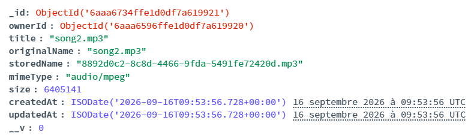
De plus un système de sécurité est pensé pour ne pas pouvoir y accéder depuis la barre d'adresse du navigateur :
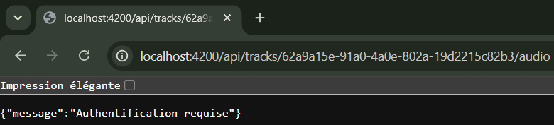
Le middleware auth bloque la requête avant même de chercher en base.

## 2. Mission 3 : Analyse amélioration de l’upload et de la lecture audio
**Prompt pour le code de la mission 3 :**
> "Pour la mission 3 j'aimerais que tu ajoute une pré-validation côté frontend avec le contrôle de taille max (25mo) et des types MIME comme wav par exemple. Le tout dès la sélection du fichier. Pendant l'upload d'un fichier veux que tu désactive le bouton le bouton et marque "envoi en cours" pour qu'il n'y est pas deux soumissions simultanées. De plus veux ajouter un message de succès et vider le formulaire une fois l'upload terminé. Améliore un peu plus le suivi de lecture et mets plus d'informations dans les cartes musique. Enfin révoque ObjectURL si l'utilisateur quitte la page."

Pour la phase de réponse aux questions de la mission 3, l'ia a été utilisé pour trouver les endroits précis du code où se situent les sujets traîtés.
### Fichiers et méthodes où se trouvent : 

#### Le choix du fichier
- **Fichier :** `frontend-starter/src/app/components/tracks-page/tracks-page.html` et `tracks-page.ts`
- **Méthode / Élément :** L'élément `<input type="file" accept="audio/*" (change)="choose($event)">` déclenche la méthode `choose(event: Event)` dans `TracksPageComponent`. Le fichier sélectionné est extrait avec `(event.target as HTMLInputElement).files?.[0]`.

#### la construction du `FormData`
- Fichier : `frontend-starter/src/app/shared/services/track.service.ts`
- Méthode : Méthode `upload(file: File, title: string)`. Un objet standard JavaScript `const body = new FormData();` est instancié puis alimenté avec `body.append('audio', file)` et `body.append('title', title)`.

#### l’appel HTTP d’upload
- Fichier : `frontend-starter/src/app/shared/services/track.service.ts` (appelé par `TracksPageComponent.upload()`)
- Méthode : `this.http.post<Track>('/api/tracks', body)` qui émet une requête HTTP `POST` multipart vers l'API.

#### la récupération du `Blob`
- Fichier : `frontend-starter/src/app/shared/services/track.service.ts`
- Méthode : Méthode `audio(id: string)`. L'appel `this.http.get('/api/tracks/${id}/audio', { responseType: 'blob' })` demande à Angular de traiter le corps de la réponse comme un objet binaire `Blob`.

#### la création de l’`ObjectURL`
- Fichier : `frontend-starter/src/app/components/tracks-page/tracks-page.ts`
- Méthode : Méthode `play(track: Track)` dans le callback de succès `next: (blob) => { ... }` via l'instruction `URL.createObjectURL(blob)`.

#### l’affectation au lecteur `<audio>`
- Fichier : `frontend-starter/src/app/components/tracks-page/tracks-page.ts` et `tracks-page.html`
- Méthode / Élément : Dans `play()`, la valeur retournée par `createObjectURL` est enregistrée dans le signal `audioUrl.set(...)`. Dans le template HTML, la balise `<audio [src]="audioUrl()" controls autoplay>` est liée de manière réactive à ce signal.

#### la révocation de l’ancienne URL
- Fichier : `frontend-starter/src/app/components/tracks-page/tracks-page.ts`
- Méthode : 
  - Dans `play(track: Track)` avant de générer une nouvelle URL : `if (previousUrl) URL.revokeObjectURL(previousUrl);`
  - À la destruction du composant avec le hook `DestroyRef.onDestroy(() => { if (url) URL.revokeObjectURL(url); })` pour éviter les fuites mémoire lors d'un changement de page/route.

### Explications du flux composants → service → `HttpClient` → API, puis API → `Blob` → `ObjectURL` → lecteur audio

- Déclenchement : L'utilisateur clique sur le bouton « play » d'un morceau dans `TracksPageComponent`.
- Délégation au service : Le composant appelle `this.service.audio(track.id)`. Le composant ne manipule pas directement les URL d'API.
- Requête HTTP : `TrackService` délègue à `HttpClient.get('/api/tracks/:id/audio', { responseType: 'blob' })`.
- Interception JWT : L'intercepteur `authInterceptor` intercepte la requête, lit le signal `token()` de `AuthService` et ajoute l'en-tête HTTP `Authorization: Bearer <token>`.
- Traitement API Express : Le serveur vérifie le JWT (`auth`), s'assure en base MongoDB que `ownerId === req.auth.sub`, puis envoie le flux binaire du fichier via `res.sendFile()`.
- Réception en `Blob` : `HttpClient` reçoit l'ensemble des octets audio et produit un objet mémoire `Blob` (type `audio/mpeg`, etc.).
- Génération de l'`ObjectURL` : `TracksPageComponent` reçoit le `Blob` dans l'Observer `next`, révoque l'ancienne URL s'il y en avait une, et appelle `URL.createObjectURL(blob)` qui retourne une URL locale temporaire de type `blob:http://localhost:4200/...`.
- Lecture : L'URL est transmise au signal `audioUrl`, ce qui met à jour l'attribut `src` de l'élément HTML `<audio>`, déclenchant la lecture audio.

### Intercepteur qui ajoute le JWT à la requête audio
Comme le montre la capture d'écran ci-dessous l’intercepteur ajoute le JWT à la requête audio : sur la ligne de requête `audio`, le statut est `200 OK` avec un type `fetch` (initié par `main.js`), ce qui prouve qu'elle a été émise par `HttpClient` et a pu recevoir le header `Authorization: Bearer <token>`. Juste en dessous apparaît la ligne `blob:http://localhost:4200/...` avec le statut `206 Partial Content` et le type `media`, correspondant à la lecture native par le navigateur de l'URL générée.
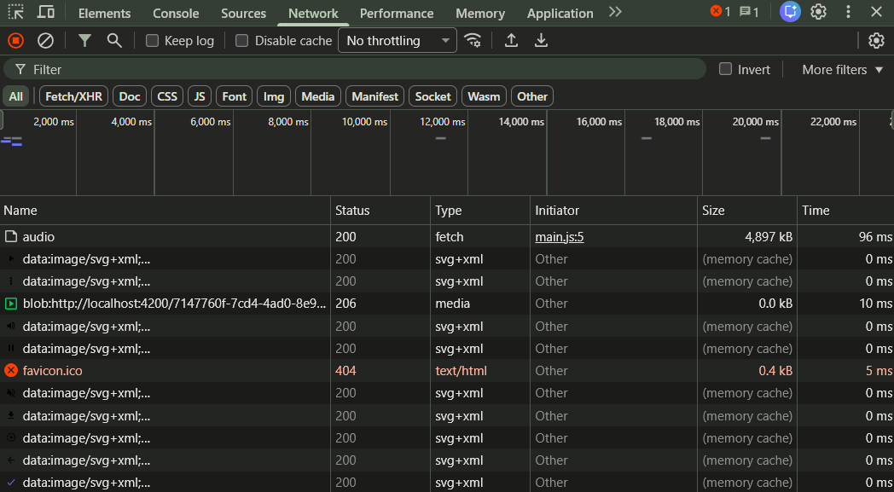
Dans le code cela se situe dans le fichier `frontend-starter/src/app/shared/interceptors/auth.interceptor.ts`. Chaque requête sortante exécutée par `HttpClient` est interceptée :
```typescript
const token = auth.token();
const req = token
  ? request.clone({ setHeaders: { Authorization: `Bearer ${token}` } })
  : request;
```
Une URL directement placée dans `src` (ex: `<audio src="/api/tracks/:id/audio">`) ne reçoit pas automatiquement ce header car c'est le moteur multimédia interne du navigateur web qui télécharge la ressource de façon autonome en HTTP standard. Ce moteur natif ne passe ni par Angular, ni par `HttpClient`, ni par les intercepteurs TypeScript, et n'a pas accès au token stocké en mémoire dans notre application.

### Contrôle du multipart et construction du FormData
Côté **backend** (`backend/src/app.js`) :
- `upload.single("audio")` impose la présence d'un champ fichier nommé exactement `audio`.
- Multer applique une limite de taille stricte : `limits: { fileSize: 25 * 1024 * 1024 }` (25 Mo).
- Multer applique un `fileFilter` qui rejette tout fichier dont le `file.mimetype` ne fait pas partie des types acceptés (`audio/mpeg`, `audio/wav`, `audio/ogg`, etc.).
- Le contrôleur lit le titre dans `req.body.title` ou utilise par défaut le nom d'origine `req.file.originalname`.

Côté **frontend** (`TrackService.upload()`) :
- L'objet `FormData` est construit avec les deux clés requises :
  ```typescript
  const body = new FormData();
  body.append('audio', file);
  body.append('title', title);
  ```

### La validation frontend améliore l’expérience mais ne remplace jamais la validation backend
La validation frontend avec la vérification de la taille et du type dès la sélection améliore  l'expérience utilisateur car il est alerté en cas d'erreur sans attendre le téléchargement inutile d'un fichier lourd ce qui permet d'éviter de consommer de la bande passante pour une requête destinée à l'échec.

Cependant, cela ne remplace pas la validation backend car le frontend s'exécute sur la machine cliente. Or un utilisateur malveillant peut facilement contourner les validations frontend. Après avoir demandé comment à l'IA : en désactivant le JavaScript, en modifiant le code dans les DevTools, ou en envoyant une requête forgée via cURL, Postman ou un script Python. Ce qui explique pourquoi seule la validation backend garantit l'intégrité, la stabilité et la sécurité du serveur.

### Mémoire buffering et streaming

#### Envoie des fichiers par le backend
Le backend utilise `res.sendFile(audioPath)` fourni par Express. En interne, cette méthode s'appuie sur `fs.createReadStream()` de Node.js. Le fichier n'est donc pas chargé entièrement en mémoire vive sous forme d'un énorme buffer : il est lu petit à petit par depuis le disque et envoyé progressivement sous forme de flux réseau vers le client.

#### Réception du fichier par le composant
Avec `HttpClient` et `responseType: "blob"`, le composant Angular ne reçoit l'objet `Blob` qu'une fois le téléchargement réseau terminé. `HttpClient` accumule l'ensemble des paquets de la réponse HTTP en mémoire avant d'émettre la valeur finale dans l'Observable (`next(blob)`). Il n'y a donc pas de lecture progressive en continu dans le composant pendant le transfert.

#### Chargement des fichiers audio
Si la bibliothèque contient 100 morceaux, les 100 fichiers audio ne sont pas chargés en mémoire dès l'affichage de la liste
car la requête de liste `TrackService.list()` appelle `GET /api/tracks` qui ne renvoie que des métadonnées textuelles JSON (`id`, `title`, `size`, `createdAt`). L'appel `TrackService.audio(track.id)` n'est déclenché que ponctuellement quand un utilisateur clique sur le bouton de lecture d'une musique (`(click)="play(track)"`).

#### Différence avec l'utilisation d'une URL HTTP
Si l'on utilisait 100 balises `<audio src="https://...">` directemes le navigateur initialiserait potentiellement 100 connexions multimédias ou préchargerait les premiers octets de chaque piste augmentant ainsi la consommation réseau et mémoire.
En revanche, le lecteur HTML gère le buffering progressif. En effet la lecture est possible avant la fin du téléchargement. Or cela est impossible ici car la ressource exige le header d'authentification.

#### URL créée par `URL.createObjectURL` obligatoirement révoquée
L'URL générée par `URL.createObjectURL(blob)` maintient en mémoire du navigateur une référence vers l'objet `Blob`. Or pour des fichiers audio lourds, écouter plusieurs morceaux à la suite sans supprimer les URLs entraînerait une fuite de mémoire progressive pouvant saturer la RAM et faire planter l'onglet du navigateur.

## 3. Fonctionnalités avancées

**Prompt :**
> « Maintenant réalisons les tâches avancées et optionnelles de ce tp2 à savoir ### AVANCÉ — Angular Material, ### AVANCÉ — Pagination Mongoose, ## Améliorations facultatives et ## AVANCÉ — Image de couverture. Pour cela installe angular/material et pour l'image tu peux choisir l'illustration automatique (ex: tags ID3). Attention pour cette phase de programmation tu dois aussi respecter tous les attendus du tp 2. Par exemple il faudra mettre à jour API_CONTRACT.md pour la pagination Mongoose »

### Rapport de ce que l'agent a fait et modifié

#### 1. Pagination Mongoose (`mongoose-aggregate-paginate-v2`)
- Backend (`backend/package.json` et `src/models/Track.js`) :
  - Installation du module `mongoose-aggregate-paginate-v2`.
  - Intégration du plugin dans le schéma Mongoose `schema.plugin(aggregatePaginate)`.
- Contrôleur Backend (`backend/src/app.js`) :
  - Remplacement de la pagination manuelle `skip`/`limit` par un pipeline d'agrégation MongoDB `Track.aggregate([...])` exécuté via `Track.aggregatePaginate(aggregate, options)`.
  - Enrichissement de la réponse JSON avec les métadonnées de pagination avancées : `hasPrevPage`, `hasNextPage`, `prevPage`, `nextPage`, `totalDocs`, `totalPages`.
- Contrat HTTP (`API_CONTRACT.md`) :
  - Mise à jour formelle de la structure de réponse `Page<Track>` pour refléter les métadonnées fournies par `aggregatePaginate`.
- Modèle Frontend (`frontend-starter/src/app/shared/models/page.model.ts`) :
  - Ajout des propriétés optionnelles correspondantes (`hasPrevPage`, `hasNextPage`, `prevPage`, `nextPage`).

#### 2. Image de couverture & extraction des tags ID3
- Extraction automatique (`backend/src/app.js`) :
  - Installation de la bibliothèque `music-metadata`.
  - Lors de l'upload `POST /api/tracks`, analyse asynchrone des métadonnées du fichier audio (`parseFile(uploadedPath)`).
  - Récupération de l'artiste (`metadata.common.artist`), de l'album (`metadata.common.album`), et de la pochette d'album (`metadata.common.picture`).
  - Encodage direct de la pochette en Data URL base64 (`data:image/...;base64,...`) stockée dans le champ `coverImage` de la collection MongoDB.
- Affichage dynamique (`frontend-starter/src/app/components/tracks-page/tracks-page.html`) :
  - Rendu responsive de la pochette dans chaque card : image ID3 réelle si présente, ou illustration par défaut stylisée.
  - Affichage de l'artiste et de l'album sous le titre de la piste.

#### 3 Paginator Angular Material (`@angular/material`)
- Installation et intégration :
  - Installation de `@angular/material` et `@angular/cdk`.
  - Importation de `MatPaginatorModule` dans `TracksPageComponent`.
- Composant UI :
  - Remplacement des boutons HTML simples par `<mat-paginator>` avec choix interactif de la taille de page (`[pageSizeOptions]="[5, 10, 20]"`), navigation complète (première, précédente, suivante, dernière) et totalisation en temps réel.
  - Liaison avec la méthode `onMatPageChange(event: PageEvent)` qui met à jour les signaux `page` et `limit` puis recharge la liste serveur.

#### Barre de progression de l'upload :
  - Ajout de `uploadWithProgress(file, title)` dans `TrackService` avec `reportProgress: true` et `observe: 'events'`.
  - Écoute des événements `HttpEventType.UploadProgress` dans `TracksPageComponent` pour mettre à jour un signal `uploadProgress` (0 à 100%).
  - Rendu d'une jauge fluide animée dans le formulaire d'import.
#### Suppression avec confirmation (`DELETE /api/tracks/:id`) :
  - Ajout de `TrackService.delete(id: string)`.
  - Ajout d'un bouton de suppression sur chaque carte de morceau avec confirmation.
  - État de suppression réactif (`deletingId`) et rechargement dynamique avec gestion automatique de la pagination si la page courante se vide.
#### Formatage lisible des tailles et des dates :
  - Méthode `formatSize(bytes)` : conversion en Ko, Mo, Go avec un chiffre après la virgule.
  - Méthode `formatDate(dateStr)` : mise en forme en date/heure locale française (`dd/MM/yyyy HH:mm`).
#### Filtre instantané par titre, artiste ou album :
  - Ajout d'un champ de recherche avec `FormControl` et signal dérivé `computed()` filtrant instantanément les cartes visibles sans solliciter inutilement le réseau.

### Ce que j'en ai compris, pourquoi j'ai voulu faire ça
L'utilisation du plugin de pagination Mongoose permet d'écrire des requêtes optimisées et extensibles côté base de données tout en garantissant un contrat HTTP. L'intégration d'Angular Material apporte des composants d'accessibilité comme le paginator configurable. Enfin, l'extraction automatique des métadonnées ID3 et la barre de progression d'upload offrent un retour visuel immédiat à l'utilisateur, ce qui est utile lors de la manipulation de fichiers volumineux.

# Rapport d'usage de l'IA - TP3

## 1. Mission 5 : Suppression d'une piste

**Prompt :**
> « Pour la Mission 5 du TP3, implémentons la suppression d'une piste audio en respectant l'architecture Angular standalone et le contrat API. Il faut donc ajouter une action « Supprimer » sur chaque card avec une boîte de confirmation. Désactive le bouton et éviter les doubles clics pendant la requête. Utilise le composant angular qui permet de notifier l'utilisateur du succès ou de l'erreur avec un message. Refresh la liste après une suppression et recule d'une page si la dernière page est vide. Enfin gère les erreurs HTTP en renvoyant à l'utilisateur une erreur visuelle. »

### Rapport de ce que l'agent a fait et analysé

- **Vérification et enrichissement du service `TrackService` (`shared/services/track.service.ts`) :**
  - Ajout de la méthode `delete(id: string)` retournant un `Observable<void>` via `this.http.delete<void>('/api/tracks/' + id)`.
  - Respect strict du principe de séparation des responsabilités : `HttpClient` reste encapsulé dans le service, les composants n'y accèdent pas directement.
- **Intégration d'Angular Material SnackBar (`TracksPageComponent`) :**
  - Ajout du fournisseur `provideAnimationsAsync()` dans `src/main.ts` et alignement de la dépendance `@angular/animations`.
  - Importation de `MatSnackBarModule` et injection de `MatSnackBar` via `inject(MatSnackBar)`.
- **Implémentation de la méthode `deleteTrack(track: Track)` dans `TracksPageComponent` :**
  - **Prévention des doubles clics :** garde immédiate `if (this.deletingId()) return;` et désactivation dynamique du bouton pendant le traitement.
  - **Confirmation utilisateur :** vérification préalable bloquante via `window.confirm(...)`.
  - **Notification réactive :** appel de `this.snackBar.open(message, 'Fermer', { duration: 4000 })` pour informer l'utilisateur sans bloquer l'UI.
  - **Gestion de la mémoire et du lecteur audio :** si la piste en cours de lecture (`currentTrack`) est celle supprimée, elle est réinitialisée et son `ObjectURL` binaire est immédiatement révoquée avec `URL.revokeObjectURL(previousUrl)`.
  - **Maintien de la cohérence de pagination :** si la piste supprimée était la dernière de la page courante (`this.tracks().length === 1 && this.page() > 1`), le signal de page recule automatiquement d'une unité avant de déclencher `this.load()`.
  - **Gestion des cas d'erreur métier :**
    - Statut `404` (piste inexistante ou déjà supprimée dans un autre onglet) : affichage d'un message d'alerte spécifique et rechargement de la liste pour resynchroniser la vue avec la base MongoDB.
    - Statut `403` (accès interdit / piste n'appartenant pas à l'utilisateur) : notification de refus d'autorisation claire.
- **Validation :** Exécution de `npm run build` confirmant une compilation complète sans aucune erreur ni avertissement.

### Ce que j'en ai compris, pourquoi j'ai voulu faire ça
La suppression d'une ressource est une opération importante qui nécessite à la fois une validation côté client avec une confirmation, une prévention du double-clic et des notifications. L'interface Angular ne suffisent pas à sécuriser une suppression : c'est le backend qui valide le JWT et vérifie que l'id du propriétaire est correct avant de supprimer le fichier. Ce prompt permet de couvrir tous les cas.

## 2. Mission 6 : Progression de l'upload

**Prompt :**
> « Pour la Mission 6 du TP3, fais évoluer le formulaire d'upload pour suivre et afficher sa progression en temps réel. Il faudra gérer l'absence d'upload, l'upload en cours avec un calcul du pourcentage dynamique allant de 0% à 100%, la réussite avec une notification, la réinitialisation du formulaire et le rechargement de la première page, l'échec avec un message d'erreur et une remise à zéro, pendant le transfert il faudra désactiver tous les champs input titre, input fichier, bouton envoyer pour interdire toute seconde action simultanée et veiller à ce qu'aucune donnée sensible ne soit affichée dans la console ou le template. »

### Rapport de ce que l'agent a fait et analysé

- **Évolution de `TrackService` (`shared/services/track.service.ts`) :**
  - Implémentation de la méthode `uploadWithProgress(file: File, title: string) : Observable<HttpEvent<Track>>`.
  - Configuration spécifique d'Angular `HttpClient` :
    ```typescript
    return this.http.post<Track>('/api/tracks', body, {
      reportProgress: true,
      observe: 'events',
    });
    ```
    - `reportProgress: true` : demande à XMLHttpRequest/Fetch d'émettre les événements de transfert réseau intermédiaires.
    - `observe: 'events'` : configure l'Observable pour qu'il émette tous les événements (`HttpEvent`) et non uniquement le corps JSON final (`HttpResponse`).
- **Gestion des 4 états réactifs dans `TracksPageComponent` :**
  - `uploadStatus = signal<'idle' | 'uploading' | 'success' | 'error'>('idle')` : machine à états explicite.
  - `uploadProgress = signal<number>(0)` : pourcentage entier calculé en temps réel.
  - `uploading = signal<boolean>(false)` : verrouillage asynchrone.
- **Traitement du flux événementiel dans la méthode `upload()` :**
  - **Événement `HttpEventType.UploadProgress` :** calcul immédiat du pourcentage via `Math.round((100 * event.loaded) / event.total)` et mise à jour du signal `uploadProgress`.
  - **Événement `HttpEventType.Response` (Succès) :**
    - Récupération de l'objet `Track` créé.
    - Passage de `uploadStatus` à `'success'`, notification par `MatSnackBar` (*« Piste « ... » importée avec succès ! »*).
    - Nettoyage du formulaire (titre et fichier remis à blanc) et rechargement de la page 1 de la bibliothèque.
  - **Gestion de l'Échec (`error`) :**
    - Capture de l'erreur réseau ou HTTP (ex: 400 fichier invalide ou > 25 Mo).
    - Passage de `uploadStatus` à `'error'`, réinitialisation de `uploadProgress` à 0% et affichage d'un toast d'erreur persistant.
- **Sécurisation de l'interface :**
  - Désactivation conjointe du bouton d'envoi (`[disabled]="!file || uploading()"`), du champ titre (`[disabled]="uploading()"`) et du sélecteur de fichier (`[disabled]="uploading()"`), empêchant tout double-envoi ou altération en cours de route.
  - Aucun log de token ou mot de passe dans les consoles.
- **Validation du build :** Compilation `npm run build` validée avec 0 erreur.


À l'inverse, un upload avec progression nécessite de suivre les paquets d'octets envoyés au serveur au fur et à mesure :
1. **Émissions multiples dans le temps :** L'Observable émet plusieurs objets `HttpEvent` successifs (type `HttpEventType.Sent`, puis une suite de `HttpEventType.UploadProgress`, et enfin `HttpEventType.Response`).
2. **Nécessité de filtrer les événements :** Le composant ne peut pas supposer que chaque valeur reçue est le corps JSON de la réponse. Il doit inspecter `event.type` avec une structure conditionnelle (`if / switch`) pour distinguer les notifications de progression de la réponse finale.
3. **Calcul d'avancement :** La progression n'est calculable que si le serveur ou le navigateur fournit la taille totale (`event.total`), nécessitant la formule `(event.loaded / event.total) * 100`.

### Ce que j'en ai compris, pourquoi j'ai voulu faire ça
Pour des fichiers annant jusqu'à 25 mo, un envoi HTTP standard donne l'impression que l'application est figée tant que le serveur n'a pas répondu. Or, en utilisant `reportProgress: true` et `observe: 'events'`, l'application informe l'utilisateur en temps réel de l'état d'avancement. Ce qui, cependant, nécessite de bien filtrer les étapes de chargement et la réponse finale. Par ailleurs, le verrouillage de tous les champs du formulaire permet qu'aucune modification ni de deuxième clic ne perturber l'envoi en cours.

### Requête HTTP standard
Dans une requête HTTP cela n'émet qu'une seule valeur unique correspondant à la réponse une fois le téléchargement terminé, puis il se complète. Alors que pour l'upload avec progression émet un flux d'événements intermédiaires au fil du transfert avant de de délivrer la réponse du serveur ce qui oblige le composant à filtrer le type d'événement reçu au lieu de traiter directement le résultat.

---

## 3. Mission 7 : Tests automatisés frontend

**Prompt :**
> « Pour la Mission 7 du TP3, on doit mettre en place une suite de tests unitaires automatisés pour le frontend sans dépendre du serveur ni de MongoDB. Configure l'environnement de test Angular/Vitest en installant ce qu'il faut et en ajustant angular.json si nécessaire. Réalises au moins trois tests unitaires concernants et vérifie qu'il émet un POST avec le bon JSON et stocke le token JWT et l'utilisateur dans les Signals. Vérifier aussi qu'il transmet page et limit dans la requête GET et teste également la suppression avec DELETE. Il faudra aussi vérifier l'injection de l'en-tête se fait correctement. Pour finir vérifie que tous les tests passent.

### Rapport de ce que l'agent a fait et analysé

- **Configuration de l'environnement de tests frontend (`angular.json`, `package.json`) :**
  - Ajout de la dépendance de développement `jsdom` (nécessaire pour simuler le DOM dans l'exécuteur Vitest sous Node.js).
  - Ajout des configurations cibles `"development"` et `"production"` sous l'architecte `build` dans `angular.json` pour permettre au builder `@angular/build:unit-test` de résoudre correctement les options de compilation.
- **Rédaction des tests unitaires (`.spec.ts`) :**
  1. **`src/app/shared/services/auth.service.spec.ts` :**
     - Test de `login()` : simule un appel avec identifiants, intercepte l'appel sortant via `httpMock.expectOne('/api/auth/login')`.
     - Vérifie la méthode HTTP (`POST`), le corps de la requête (`{ email, password }`), et s'assure qu'après `req.flush(mockResponse)`, le signal `token()`, le signal `currentUser()` et la clé `gpc_token` du `localStorage` sont mis à jour de manière synchrone.
  2. **`src/app/shared/services/track.service.spec.ts` :**
     - Test de `list(page, limit)` : vérifie la méthode (`GET`), l'URL `/api/tracks`, et la présence exacte des paramètres d'URL `page=2` et `limit=5`.
     - Test de `delete(id)` : vérifie que l'URL appelée est bien `/api/tracks/track-123` avec la méthode `DELETE` et simule une réponse `204 No Content`.
  3. **`src/app/shared/interceptors/auth.interceptor.spec.ts` :**
     - Test avec token : configure `AuthService.token.set('my-secret-jwt-token')`, émet une requête HTTP et valide que l'intercepteur a cloné la requête en y ajoutant `Authorization: Bearer my-secret-jwt-token`.
     - Test sans token : configure `AuthService.token.set(null)`, émet une requête d'authentification et valide que l'en-tête `Authorization` est totalement absent.
- **Exécution et validation des tests :**
  - Commande : `npm test` (`ng test --watch=false`).
  - **Résultat :** 3 fichiers de test exécutés, **5 tests passés avec succès (100% de réussite)**.

```text
 ✓ src/app/shared/services/track.service.spec.ts (2 tests)
 ✓ src/app/shared/services/auth.service.spec.ts (1 test)
 ✓ src/app/shared/interceptors/auth.interceptor.spec.ts (2 tests)
 Test Files  3 passed (3)
      Tests  5 passed (5)
```

### Pourquoi les tests frontend doivent s'exécuter avec des réponses HTTP simulées
1. **Indépendance et reproductibilité (isolation) :** Si les tests dépendaient d'un serveur réel ou d'une base MongoDB, un problème réseau, une base vide ou une latence serveur ferait échouer les tests du frontend alors même que le code TypeScript est parfaitement valide. Les tests simulés via `HttpTestingController` s'exécutent de façon déterministe et instantanée (quelques millisecondes).
2. **Vérification du contrat sans effets de bord :** Le mock permet d'inspecter précisément ce que le code Angular envoie sur le réseau (URL, verbe HTTP, headers `Authorization`, corps JSON) sans modifier de vraies données en base ni envoyer de vrais fichiers audio sur le disque.
3. **Simulation aisée des cas d'erreur :** Simuler des erreurs réseau, des codes 401, 403, 404 ou 500 se fait en une ligne (`req.flush(null, { status: 401, statusText: 'Unauthorized' })`), ce qui serait beaucoup plus complexe et lourd à orchestrer avec une vraie base de données.

### Ce que j'en ai compris, pourquoi j'ai voulu faire ça
Les tests automatisés sont nécessaires pour sécuriser les évolutions futures d'une application : ils permettent de vérifier en quelques secondes qu'aucune régression n'a été introduite sur l'authentification ou la gestion des requêtes. De plus on valide que le frontend respecte le contrat HTTP de API_CONTRACT.md` en vérifiant les routes, les verbes et les en-têtes sans dépendre d'un environnement externe comme MongoDB.

### Tests frontend
La commande `npm test` dans le frontend lance Vitest. Comme le montre la capture d'écran, les 3 suites de tests unitaires isolés s'exécutent avec succès.
- `auth.service.spec.ts` (1 test) : valide l'émission de la requête `POST /api/auth/login` avec les bons identifiants et la mise à jour des Signals et du `localStorage`.
- `track.service.spec.ts` (2 tests) : confirme la transmission des paramètres page et limit sur `GET /api/tracks` ainsi que l'appel de `DELETE /api/tracks/:id`.
- `auth.interceptor.spec.ts` (2 tests) : valide l'ajout automatique de l'en-tête `Authorization: Bearer <token>` sur les requêtes ainsi qu'elle n'apparaît pas sur les routes publiques.
Au total, les 5 tests sont passés avec 100% de réussite sans aucune dépendance envers le serveur réel ou MongoDB.
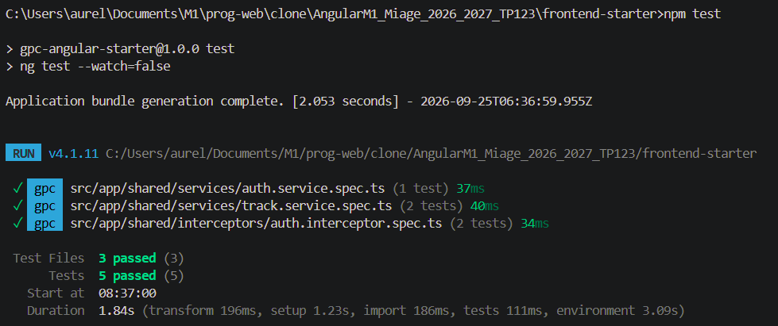

### Tests backend
La commande `npm test` dans le backend active le test de Node.js. Comme visible ci-dessous, les 2 tests automatisés passent avec succès.
- Le premier test vérifie la disponibilité de l'endpoint `GET /api/health` qui répond en `200 OK` de manière complètement autonome, sans avoir besoin de se connecter à MongoDB Atlas.
- Le deuxième test valide l'intégrité des schémas Mongoose User et Track, la conversion automatique de l'email en minuscules et la conformité de `ref: "User"` sur le champ `ownerId`.
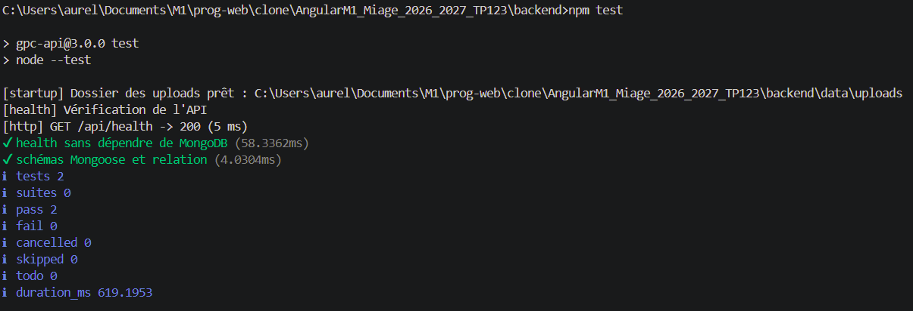