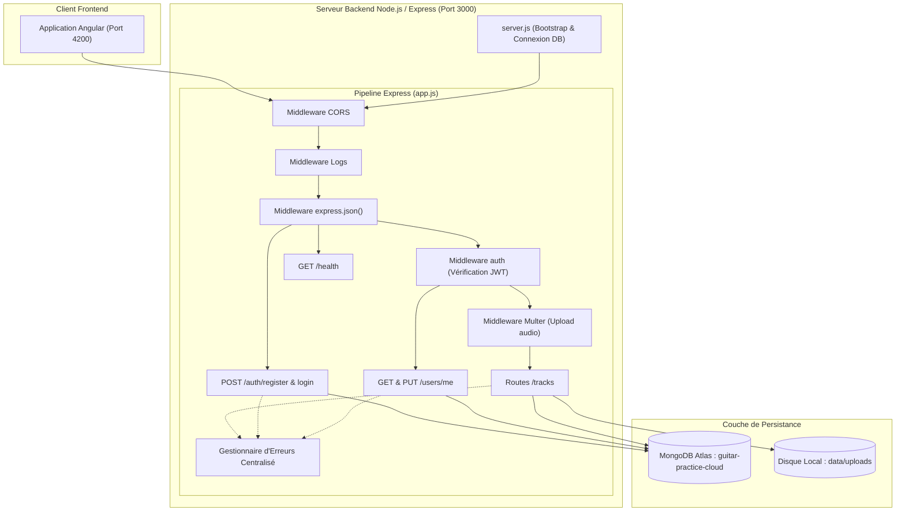
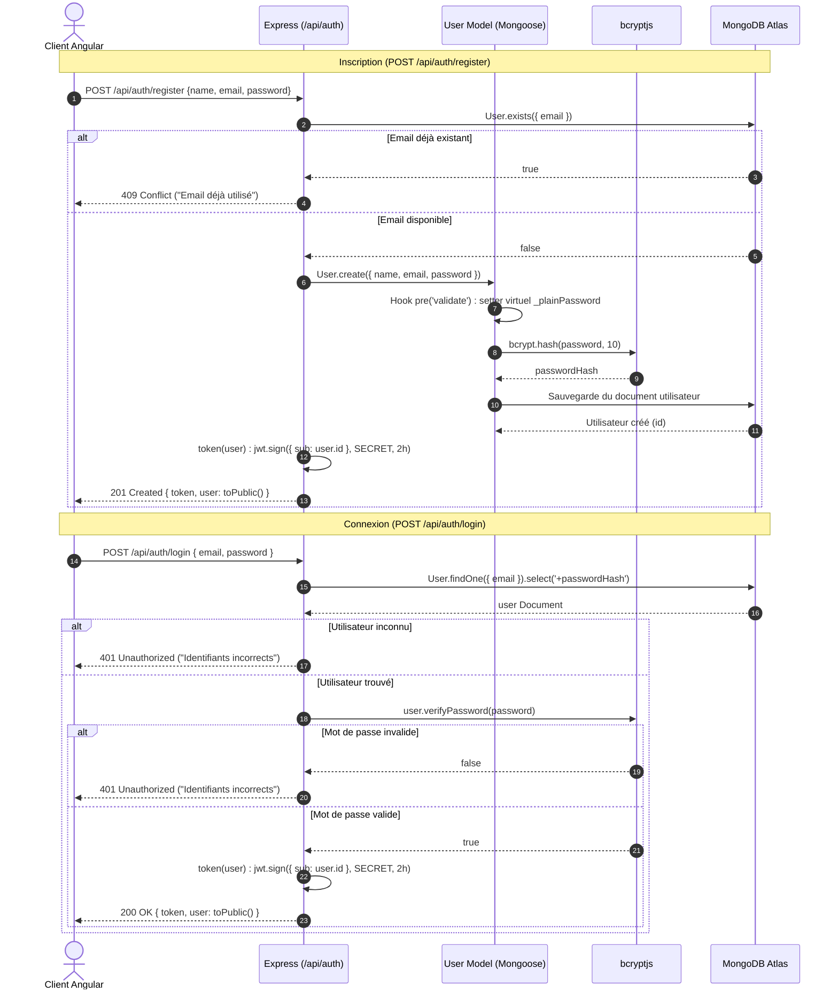
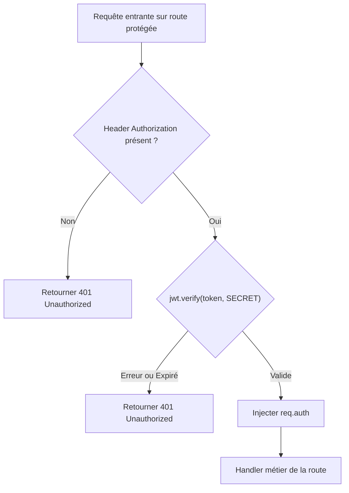
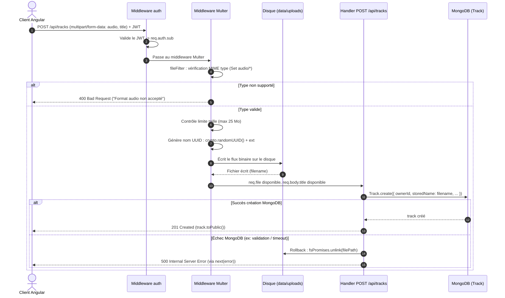
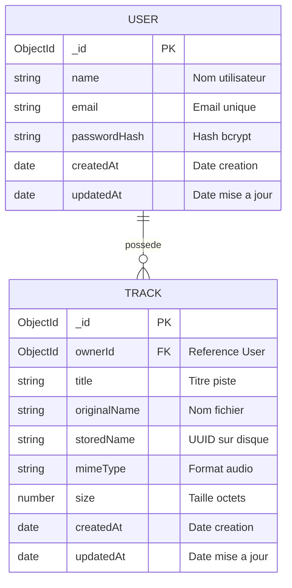

# Analyse Approfondie de l'Architecture Backend (Guitar Practice Cloud)

Ce document présente une analyse technique détaillée de l'API Node.js/Express du projet **Guitar Practice Cloud**, couvrant son architecture, ses workflows clés, ses choix technologiques, ainsi qu'une revue critique orientée sécurité et maintenabilité.

---

## 1. Technologies et Modules Utilisés

Le backend repose sur l'écosystème Node.js moderne (support ESM natif `"type": "module"`) et s'appuie sur une sélection ciblée de dépendances de production :

| Technologie / Module | Version | Rôle & Justification Technique |
| :--- | :--- | :--- |
| **Node.js** | `>= 22.0.0` | Environnement d'exécution JavaScript. Utilisation des modules ESM natifs, du test runner natif (`node:test`, `node:assert/strict`), de `node:crypto` pour la génération d'UUIDv4 et de `node:fs/promises`. Utilise `--env-file=.env` au démarrage sans dépendance `dotenv`. |
| **Express** | `^5.1.0` | Framework web minimaliste en version 5. Gestion native des rejets asynchrones (`async/await` sans middleware wrapper pour capter les exceptions non gérées), routage et pipeline de middlewares. |
| **Mongoose** | `^9.0.0` | ODM (*Object Document Mapper*) pour MongoDB. Modélisation stricte des schémas (`User`, `Track`), hooks de cycle de vie (`pre('validate')`), virtuals, indexation et requêtage optimisé (`lean()`). |
| **bcryptjs** | `^3.0.2` | Hachage sécurisé et salage des mots de passe utilisateurs (facteur de coût de 10). Implémentation pure JavaScript évitant les dépendances de compilation native C++. |
| **jsonwebtoken (JWT)** | `^9.0.2` | Génération et vérification cryptographique des jetons de session sans état (stateless tokens) avec algorithme HMAC SHA-256. |
| **multer** | `^2.0.2` | Middleware de traitement des requêtes HTTP `multipart/form-data`. Stockage direct sur disque (*diskStorage*), limitation de la taille (25 Mo) et filtrage des types MIME. |
| **cors** | `^2.8.5` | Middleware de gestion des en-têtes *Cross-Origin Resource Sharing* pour autoriser le frontend Angular à dialoguer avec l'API. |

---

## 2. Architecture Globale et Découpage des Responsabilités

L'architecture actuelle suit une structure modulaire centrée sur la séparation entre le démarrage du serveur, la configuration de l'application et la modélisation des données.

```
backend/
├── data/
│   └── uploads/           # Stockage physique des fichiers audio (fichiers binaires)
├── src/
│   ├── models/
│   │   ├── Track.js       # Schéma Mongoose & méthodes de la ressource Piste
│   │   └── User.js        # Schéma Mongoose, hashage et validation Utilisateur
│   ├── app.js             # Factory createApp(), middlewares, routes et gestionnaire d'erreurs
│   └── server.js          # Point d'entrée : connexion MongoDB, seed démo, écoute HTTP
├── test/
│   └── api.test.js        # Tests d'intégration légers avec le runner natif Node.js
├── .env                   # Variables d'environnement (non versionné)
└── package.json           # Métadonnées et scripts npm
```

### Schéma d'Architecture Globale



---

## 3. Workflows Détaillés

### 3.1. Workflow d'Authentification (Inscription & Connexion)

L'authentification est basée sur des jetons **JWT (JSON Web Tokens)** sans état :
1. Le client envoie les identifiants en JSON.
2. Le backend valide les champs (présence, longueur minimale de 8 caractères, unicité de l'email).
3. Le mot de passe est haché de façon transparente par Mongoose grâce à un hook `pre('validate')` et la fonction `bcrypt.hash()`. Le mot de passe en clair n'est jamais stocké.
4. À la connexion, `bcrypt.compare()` valide l'empreinte stockée dans `passwordHash` (non projeté par défaut grâce à `select: false`).
5. Un jeton JWT signé avec une clé secrète (`JWT_SECRET`) et valide 2 heures est retourné au client, contenant l'identifiant MongoDB de l'utilisateur dans la revendication standard `sub`.



### 3.2. Workflow d'Accès Sécurisé (Middleware `auth`)

Le middleware `auth` intercepte les requêtes privées :
- Il vérifie la présence de l'en-tête `Authorization: Bearer <token>`.
- Il décode et valide la signature cryptographique ainsi que la date d'expiration via `jwt.verify()`.
- En cas de succès, l'objet décode est injecté dans `req.auth` (notamment `req.auth.sub` qui contient l'identifiant MongoDB de l'utilisateur).



---

### 3.3. Workflow d'Upload et de Stockage de Fichiers Audio

Le traitement des fichiers audio est hybride :
- Les **octets binaires** sont streamés et enregistrés directement sur le système de fichiers (`data/uploads/`).
- Les **métadonnées** (titre, nom original, nom de stockage UUID, type MIME, taille en octets, `ownerId`) sont sauvegardées dans la collection `tracks` de MongoDB.



---

### 3.4. Workflow de Lecture et de Suppression Sécurisées

La sécurité des données repose sur l'isolation stricte par propriétaire (`ownerId: req.auth.sub`) :
- **Lecture audio (`GET /api/tracks/:id/audio`)** :
  Le backend vérifie en base que la piste appartient bien à l'utilisateur appelant (`ownerId: req.auth.sub`). Si ce n'est pas le cas ou si l'ID n'existe pas, un statut 404 uniforme est retourné. Le fichier est ensuite transmis via `res.sendFile(audioPath)`, qui gère nativement le streaming et les en-têtes HTTP `Range` (permettant la lecture progressive et le buffering dans le lecteur `<audio>`).
- **Suppression (`DELETE /api/tracks/:id`)** :
  La suppression utilise `findOneAndDelete({ _id: id, ownerId: req.auth.sub })`. Une fois la métadonnée retirée de la base, le fichier physique associé (`storedName`) est supprimé du disque avec `fsPromises.unlink`.

---

## 4. Échanges avec la Base de Données (Mongoose & MongoDB Atlas)

### Schéma Entité-Association (ERD)



### Optimisations et Bonnes Pratiques Observées
- **Indexation composite** : `schema.index({ ownerId: 1, createdAt: -1 })` dans `Track.js`. Cette indexation accélère le tri chronologique inverse des pistes pour un utilisateur donné lors de la pagination.
- **Sélection et masquage des champs sensibles** : Les propriétés `passwordHash` et `storedName` sont configurées avec `select: false` au niveau du schéma. Elles ne risquent pas d'être accidentellement injectées dans une réponse JSON vers le client.
- **Requêtes parallélisées et légères** : Lors de la pagination (`GET /api/tracks`), `Promise.all` exécute simultanément le `Track.find(...).lean()` et le `Track.countDocuments(...)`. L'utilisation de `.lean()` désactive l'instanciation coûteuse des documents Mongoose pour les lectures simples.

---

## 5. Revue Critique du Code et Vulnérabilités Identifiées

L'analyse du code source met en lumière plusieurs axes critiques d'amélioration, classés ci-dessous par ordre de priorité et d'impact sur la sécurité et la production :

| Sévérité | Nombre | Catégories concernées |
| :--- | :---: | :--- |
| 🔴 **Critique** | 2 | Sécurité (JWT secret par défaut, absence de Rate Limiting) |
| 🟠 **Élevée** | 3 | Sécurité / DoS (CORS permissif, type MIME non vérifié, absence Helmet) |
| 🟡 **Moyenne** | 3 | Architecture & Robustesse (Monolithe, atomicité disque/BD, stockage local) |
| 🟢 **Faible** | 2 | Qualité & Validation (Validation mots de passe, logs non structurés) |

### Synthèse Critique par Niveau de Priorité

| Priorité | Intitulé du Problème | Localisation | Impact & Risque |
| :--- | :--- | :--- | :--- |
| 🔴 **1. CRITIQUE** | **Clé secrète JWT avec valeur par défaut codée en dur** | `src/app.js:27` | Si `JWT_SECRET` est absent du `.env`, le serveur utilise `"tp1-development-secret"`. N'importe qui peut fabriquer des jetons valides et usurper l'identité de n'importe quel compte sans mot de passe. |
| 🔴 **2. CRITIQUE** | **Absence de limitation de débit (Rate Limiting) sur l'authentification** | `src/app.js:164, 195` | Vulnérable aux attaques par force brute sur `/api/auth/login` et aux attaques par déni de service (DoS) par épuisement CPU (`bcrypt.compare` consomme beaucoup de cycles processeur). |
| 🟠 **3. ÉLEVÉE** | **Configuration CORS permissive universelle** | `src/app.js:145` | `app.use(cors())` autorise toutes les origines (`*`). N'importe quel site web malveillant exécuté dans le navigateur de l'utilisateur peut adresser des requêtes à l'API. |
| 🟠 **4. ÉLEVÉE** | **Validation du type MIME basée uniquement sur les données client** | `src/app.js:109-119` | Multer se fie à `file.mimetype`, qui provient directement de l'en-tête HTTP transmis par le client. Un attaquant peut injecter un fichier malveillant (ex: script PHP, HTML ou exécutable) en falsifiant le header `Content-Type: audio/mpeg`. |
| 🟠 **5. ÉLEVÉE** | **Absence des en-têtes HTTP de sécurisation standard (`Helmet`)** | `src/app.js` | L'application ne configure pas les en-têtes recommandés (HSTS, `X-Content-Type-Options: nosniff`, `X-Frame-Options: DENY`, `Content-Security-Policy`). |
| 🟡 **6. MOYENNE** | **Monolithe applicatif dans `app.js` (Manque de modularité)** | `src/app.js` | L'ensemble des routes (auth, users, tracks), les middlewares et la logique métier sont regroupés dans un unique fichier de 460 lignes. Manque d'architecture en couches (Controllers / Services / Routers). |
| 🟡 **7. MOYENNE** | **Absence d'atomicité sur les opérations mixtes BD / Disque** | `src/app.js:345-375, 409-438` | Bien qu'un nettoyage manuel soit tenté lors de l'upload, la suppression dans `DELETE /api/tracks/:id` supprime le document Mongoose avant d'effacer le fichier. En cas d'échec disque, le fichier devient orphelin sans référence en base. |
| 🟡 **8. MOYENNE** | **Couplage fort au système de fichiers local (`data/uploads`)** | `src/app.js:14` | Empêche la montée en charge horizontale (*scaling*) sur plusieurs conteneurs ou instances sans volume réseau partagé. |
| 🟢 **9. FAIBLE** | **Validation de saisie manuelle et minimale** | `src/app.js:169` | Validation limitée à `password.length < 8`. Absence de validation de complexité du mot de passe et absence de schéma de validation robuste (ex: Zod, Joi ou express-validator). |
| 🟢 **10. FAIBLE** | **Système de journalisation synchrone rudimentaire** | `src/app.js:132-140` | Utilisation directe de `console.log` au lieu d'un logger structuré (ex: Winston ou Pino) permettant des niveaux de log configurables par environnement et des formats JSON exploitables en production. |

---

## 6. Recommandations et Plan d'Amélioration

### Recommandations Sécurité Immédiates

1. **Élimination du Fallback JWT (Fail-Fast) :**
   Empêcher formellement le serveur de démarrer si `JWT_SECRET` n'est pas défini :
   ```javascript
   if (!process.env.JWT_SECRET) {
     throw new Error("Variable d'environnement critique manquante : JWT_SECRET");
   }
   const SECRET = process.env.JWT_SECRET;
   ```

2. **Mise en place de `express-rate-limit` :**
   Protéger `/api/auth/login` et `/api/auth/register` contre les attaques par force brute (ex: maximum 5 tentatives par tranche de 15 minutes par IP).

3. **Restriction CORS :**
   Limiter CORS aux origines explicitement approuvées :
   ```javascript
   app.use(cors({
     origin: process.env.CLIENT_URL || "http://localhost:4200",
     methods: ["GET", "POST", "PUT", "DELETE"],
     allowedHeaders: ["Content-Type", "Authorization"]
   }));
   ```

4. **Intégration de `helmet` :**
   Ajouter le middleware `helmet()` pour masquer l'en-tête `X-Powered-By: Express` et configurer automatiquement les défenses XSS, Clickjacking et reniflage MIME.

5. **Validation Réelle des Fichiers Audio (Magic Numbers) :**
   Compléter le filtrage Multer par la vérification des premiers octets du fichier (*magic bytes*) via la bibliothèque `file-type` après écriture temporaire, pour certifier qu'il s'agit d'un flux binaire audio légitime.

### Recommandations d'Architecture et d'Évolution

1. **Refactorisation en Architecture MVC / Routers Express :**
   Découper `app.js` en modules spécialisés :
   - `routes/auth.routes.js`
   - `routes/user.routes.js`
   - `routes/track.routes.js`
   - `controllers/...`
   - `middlewares/auth.middleware.js`
   - `middlewares/upload.middleware.js`

2. **Abstraction du Stockage Fichier (Storage Adapter) :**
   Introduire une interface de stockage (`StorageService`) permettant d'alterner de manière transparente entre le stockage disque local (`LocalStorageService`) pour le développement et un stockage objet distant (ex: AWS S3 / MinIO) pour la production.

3. **Validation Déclarative avec Zod ou Joi :**
   Définir des schémas de validation stricts pour les corps de requêtes (`name`, `email`, `password`, `title`) afin de rejeter immédiatement toute payload malformée avant d'atteindre les contrôleurs.
