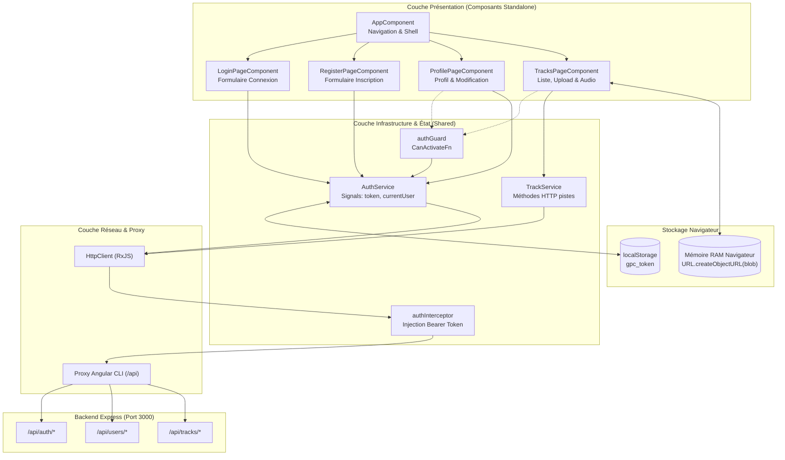
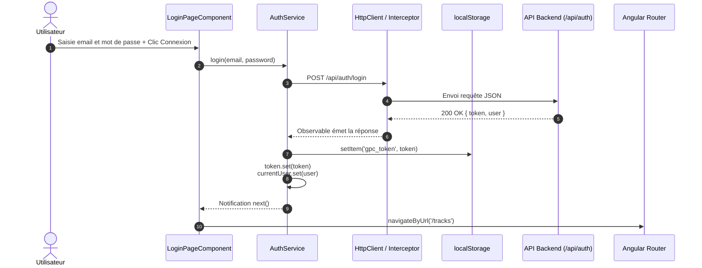
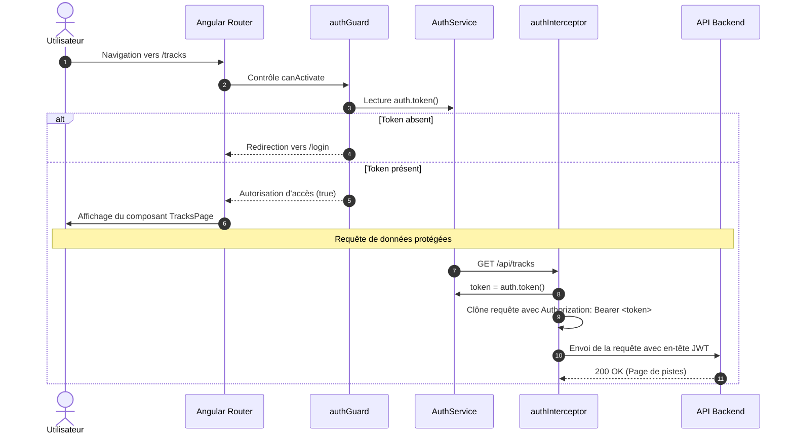
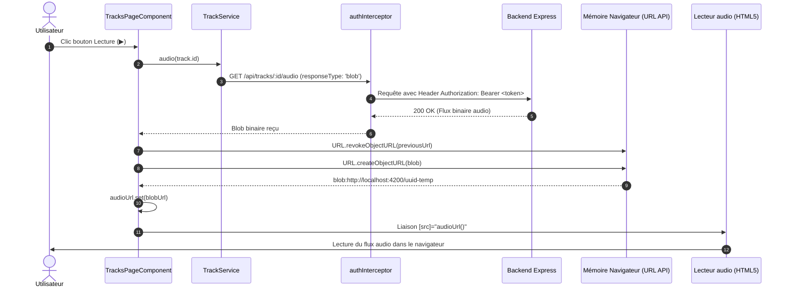

# Analyse Approfondie de l'Architecture Frontend (Guitar Practice Cloud)

Ce document présente une analyse technique détaillée du starter frontend Angular 22 du projet **Guitar Practice Cloud**, décrivant son architecture logicielle, ses technologies, ses flux de données reliant le client à l'API backend, ainsi qu'une revue critique orientée sécurité, robustesse et performance.

---

## 1. Technologies et Modules Utilisés

Le frontend est développé avec la toute dernière génération du framework Angular (version 22) dans un paradigme moderne résolument orienté *standalone* et *Signals-first* :

| Technologie / Module | Version | Rôle & Justification Technique |
| :--- | :--- | :--- |
| **Angular Core & Common** | `^22.1.0` | Cœur du framework. Architecture 100 % Standalone (les composants sont autonomes par défaut, sans `NgModule`). Détection de changement moderne basée sur les **Signals** (`signal()`, `computed()`) et injection de dépendances moderne via `inject()`. |
| **Angular Forms** | `^22.1.0` | Module de formulaires réactifs (`ReactiveFormsModule`, `FormGroup`, `FormControl`, `Validators`). Permet une gestion synchrone et immutable de l'état des saisies avec typage strict (`nonNullable: true`). |
| **Angular Router** | `^22.1.0` | Gestion de la navigation SPA (Single Page Application). Utilisation de `provideRouter()`, configuration déclarative de routes avec `CanActivateFn` fonctionnel (`authGuard`). |
| **Angular HttpClient** | `^22.1.0` | Client HTTP basé sur RxJS (`provideHttpClient()`). Intégration d'intercepteurs fonctionnels (`HttpInterceptorFn` via `withInterceptors([authInterceptor])`) pour l'injection automatisée du header JWT. |
| **RxJS** | `~7.8.0` | Bibliothèque de programmation réactive pour la gestion des flux asynchrones HTTP (`pipe`, `tap`). |
| **Proxy de Développement** | Angular CLI | `proxy.conf.json` redirige les requêtes relatives `/api/*` vers `http://localhost:3000` afin d'éliminer les problèmes de CORS lors du développement local. |
| **Vitest** | `^4.0.8` | Runner de tests automatisés unitaire et d'intégration moderne et ultra-rapide remplaçant Karma/Jasmine. |
| **TypeScript** | `~6.0.0` | Langage de développement avec vérification de types stricte. |

---

## 2. Architecture Globale et Structure des Fichiers

Le starter frontend suit les recommandations officielles d'Angular et la structure par responsabilité :

```
frontend-starter/
├── src/
│   ├── app/
│   │   ├── components/                 # Composants d'interface (Pages & Shell)
│   │   │   ├── app/                    # Shell racine : header, navigation et router-outlet
│   │   │   ├── login-page/             # Page de connexion (Reactive Form)
│   │   │   ├── register-page/          # Page d'inscription (Reactive Form)
│   │   │   ├── profile-page/           # Consultation et édition du nom utilisateur
│   │   │   └── tracks-page/            # Bibliothèque paginée, upload multipart et lecteur
│   │   ├── shared/                     # Infrastructure transverse partagée
│   │   │   ├── guards/                 # Gardes de navigation fonctionnels (auth.guard.ts)
│   │   │   ├── interceptors/           # Intercepteurs HTTP fonctionnels (auth.interceptor.ts)
│   │   │   ├── models/                 # Interfaces et types TypeScript (User, Track, Page)
│   │   │   └── services/               # Services d'état et d'accès API (AuthService, TrackService)
│   │   └── routes.ts                   # Configuration centralisée des routes
│   ├── index.html                      # Page HTML hôte
│   ├── main.ts                         # Bootstrap de l'application (bootstrapApplication)
│   └── styles.css                      # Feuilles de style globales
├── proxy.conf.json                     # Redirection proxy vers le backend Express
└── package.json                        # Dépendances et scripts de build/test
```

### Schéma d'Architecture Globale Frontend <-> Backend



---

## 3. Navigation des Données et Workflows Frontend-Backend

### 3.1. Workflow d'Authentification et Propagation d'État (Login / Register)

L'authentification s'appuie sur une synchronisation entre le stockage persistant (`localStorage`), les signaux Angular réactifs (`signal`) et le routeur :

1. L'utilisateur saisit ses identifiants dans un `FormGroup` réactif.
2. Le composant invoque `AuthService.login()` ou `AuthService.register()`.
3. `HttpClient` envoie la requête `POST /api/auth/*`.
4. L'opérateur RxJS `tap` intercepte la réponse `{ token, user }` :
   - Il persiste le jeton dans `localStorage.setItem('gpc_token', token)`.
   - Il met à jour le signal `token` et le signal `currentUser`.
5. Le composant reçoit la notification `next` et déclenche la navigation vers `/tracks` ou `/profile`.



---

### 3.2. Workflow de Sécurisation des Requêtes et Routage (`authGuard` & `authInterceptor`)

Toute route protégée et toute requête vers l'API privée s'articulent autour du jeton JWT :



---

### 3.3. Workflow d'Upload Multipart (`TracksPageComponent`)

L'upload exploite l'objet natif du navigateur `FormData` pour transmettre conjointement le fichier audio et les métadonnées texte sans configuration manuelle d'en-têtes multipart :

1. L'utilisateur choisit un fichier dans `<input type="file">`, capturé par l'événement `choose($event)`.
2. Au clic sur "Envoyer", `TrackService.upload()` instancie un `FormData` et y injecte `audio` (le binaire) et `title` (le texte).
3. `HttpClient.post('/api/tracks', body)` détecte le type `FormData` et laisse le navigateur calculer automatiquement le header `Content-Type: multipart/form-data; boundary=...`.
4. L'`authInterceptor` ajoute l'en-tête `Authorization: Bearer <token>`.
5. En cas de succès 201, le formulaire est réinitialisé et la page 1 de la bibliothèque est rafraîchie.

---

### 3.4. Workflow de Lecture Audio Sécurisée (`Blob` & `ObjectURL`)

Une balise standard `<audio src="/api/tracks/123/audio">` ne peut pas injecter d'en-tête HTTP personnalisé `Authorization`. Pour écouter une piste protégée, le starter utilise une approche en mémoire :



---

## 4. Revue Critique du Code Frontend et Vulnérabilités de Sécurité

L'examen approfondi du code frontend révèle plusieurs vulnérabilités et axes d'amélioration, hiérarchisés ci-dessous par ordre d'importance et de sévérité :

| Sévérité | Nombre | Catégories concernées |
| :--- | :---: | :--- |
| 🔴 **Critique** | 2 | Sécurité (JWT dans LocalStorage, absence de gestion 401 dans intercepteur) |
| 🟠 **Élevée** | 3 | Sécurité & Robustesse (Fuite mémoire ObjectURL, Guard naïf, Intercepteur non ciblé) |
| 🟡 **Moyenne** | 2 | Validation & UX (Validation formulaires manquante, absence d'état de chargement upload) |
| 🟢 **Faible** | 2 | Ergonomie & Qualité (Console.debug en production, navigation non synchronisée) |

---

### Synthèse Critique Hiérarchisée

| Priorité | Intitulé du Problème | Localisation | Impact & Risque |
| :--- | :--- | :--- | :--- |
| 🔴 **1. CRITIQUE** | **Stockage du JWT dans le `localStorage` (Vulnérabilité XSS)** | `shared/services/auth.service.ts:13, 46` | Le `localStorage` est accessible par n'importe quel script JavaScript exécuté sur la page. Si une vulnérabilité XSS est présente (via une dépendance ou une injection HTML), le jeton JWT peut être immédiatement volé et exfiltré. |
| 🔴 **2. CRITIQUE** | **Absence de traitement des statuts 401 dans l'intercepteur HTTP** | `shared/interceptors/auth.interceptor.ts` | Lorsque le JWT expire (durée de 2h côté backend), l'intercepteur transmet l'erreur sans réagir. L'utilisateur reste bloqué sur des pages silencieusement brisées sans purge du token ni redirection automatique vers `/login`. |
| 🟠 **3. ÉLEVÉE** | **Fuite mémoire d'`ObjectURL` et absence de nettoyage à la destruction** | `components/tracks-page/tracks-page.ts:71-74` | `URL.createObjectURL(blob)` alloue la mémoire RAM du navigateur pour chaque fichier audio téléchargé (jusqu'à 25 Mo). Si l'utilisateur quitte la page sans changer de morceau, l'URL n'est jamais révoquée (`ngOnDestroy` absent). Cela peut saturer la mémoire vive lors d'une session prolongée. |
| 🟠 **4. ÉLEVÉE** | **Garde de routage (`authGuard`) purement cosmétique** | `shared/guards/auth.guard.ts:10` | Le guard vérifie uniquement si `auth.token()` est non vide dans le signal local. Il ne vérifie ni le format, ni la date d'expiration (`exp`), ni la validité réelle du jeton auprès du serveur. Une chaîne arbitraire insérée dans `localStorage` trompe le guard. |
| 🟠 **5. ÉLEVÉE** | **Intercepteur HTTP non scopé (Risque de fuite d'identifiants vers des tiers)** | `shared/interceptors/auth.interceptor.ts:11` | Le header `Authorization: Bearer <token>` est injecté aveuglément sur toutes les requêtes sortantes sans vérifier si l'URL cible appartient au domaine de l'API. Si l'application appelle ultérieurement une API externe (ex: CDN d'images ou service de métadonnées), le token sera divulgué à ce tiers. |
| 🟡 **6. MOYENNE** | **Déficit de validation des formulaires côté client** | `components/register-page/register-page.ts:20` & `tracks-page.ts:27` | À l'inscription, aucun validateur `Validators.minLength(8)` n'est configuré (alors que le backend rejette les mots de passe < 8 caractères). Pour l'upload, la taille du fichier (25 Mo) et son extension ne sont pas vérifiées avant l'envoi réseau du `FormData`. |
| 🟡 **7. MOYENNE** | **Absence de barre de progression et de désactivation de soumission multiple** | `components/tracks-page/tracks-page.ts:52-65` | Lors de l'envoi d'un fichier audio volumineux, aucun pourcentage n'est affiché et le bouton "Envoyer" n'est pas désactivé pendant la transmission, risquant des soumissions multiples concurrentes. |
| 🟢 **8. FAIBLE** | **Journalisation en clair dans la console en environnement de production** | Tous les composants et services | Présence multiple de `console.debug()` et `console.error()` qui exposent la structure des données et des identifiants dans la console du navigateur. |
| 🟢 **9. FAIBLE** | **Désynchronisation visuelle de la barre de navigation principale** | `components/app/app.html:9` | La barre de navigation affiche toujours le lien "Connexion" même quand l'utilisateur est authentifié, et ne propose aucun bouton de "Déconnexion" ni affichage du nom de l'utilisateur. |

---

## 5. Recommandations et Améliorations Proposées

### 5.1. Recommandations Sécurité Immédiates

#### 1. Traitement des Réponses 401 dans `authInterceptor`
Modifier l'intercepteur pour écouter les réponses d'erreur HTTP et déconnecter immédiatement l'utilisateur si le jeton est invalide ou expiré :
```typescript
export const authInterceptor: HttpInterceptorFn = (request, next) => {
  const auth = inject(AuthService);
  const router = inject(Router);
  const token = auth.token();

  // Filtrer pour n'envoyer le JWT qu'aux routes /api internes
  const isApiUrl = request.url.startsWith('/api');
  const authReq = (token && isApiUrl)
    ? request.clone({ setHeaders: { Authorization: `Bearer ${token}` } })
    : request;

  return next(authReq).pipe(
    catchError((error: HttpErrorResponse) => {
      if (error.status === 401) {
        auth.logout();
        void router.navigate(['/login'], { queryParams: { expired: 'true' } });
      }
      return throwError(() => error);
    })
  );
};
```

#### 2. Libération Propre de la Mémoire Audio (`DestroyRef`)
Ajouter la libération de l'`ObjectURL` lorsque le composant est détruit ou lorsque la route change :
```typescript
export class TracksPageComponent {
  private readonly destroyRef = inject(DestroyRef);
  readonly audioUrl = signal('');

  constructor() {
    this.destroyRef.onDestroy(() => {
      const url = this.audioUrl();
      if (url) URL.revokeObjectURL(url);
    });
  }
}
```

#### 3. Sécurisation du Stockage de Jeton
- **Idéal en production :** Configurer le backend pour émettre un cookie `HttpOnly; Secure; SameSite=Strict`, rendant le vol de token impossible par script XSS.
- **Alternative SPA :** Stocker le JWT uniquement en mémoire d'application (dans un Signal ou service), et rafraîchir la session via un cookie de rafraîchissement (*refresh token*).

### 5.2. Recommandations UX et Validation

1. **Validation stricte côté client :**
   - Inscription : `password: new FormControl('', [Validators.required, Validators.minLength(8)])`.
   - Upload : Dans `choose($event)`, vérifier immédiatement `if (file.size > 25 * 1024 * 1024)` et lever un message d'alerte explicite avant même d'autoriser le clic sur "Envoyer".
2. **Gestion de la Progression de l'Upload (Objectif TP3) :**
   Utiliser `HttpClient` avec `{ reportProgress: true, observe: 'events' }` pour calculer le pourcentage d'avancement réel et l'afficher dans une jauge ou barre de progression.
3. **Barre de navigation réactive :**
   Injecter `AuthService` dans `AppComponent` et utiliser le flux de contrôle moderne dans `app.html` :
   ```html
   @if (auth.token()) {
     <a routerLink="/tracks">Backing tracks</a>
     <a routerLink="/profile">Profil</a>
     <button type="button" (click)="auth.logout()">Déconnexion</button>
   } @else {
     <a routerLink="/login">Connexion</a>
     <a routerLink="/register">Inscription</a>
   }
   ```
